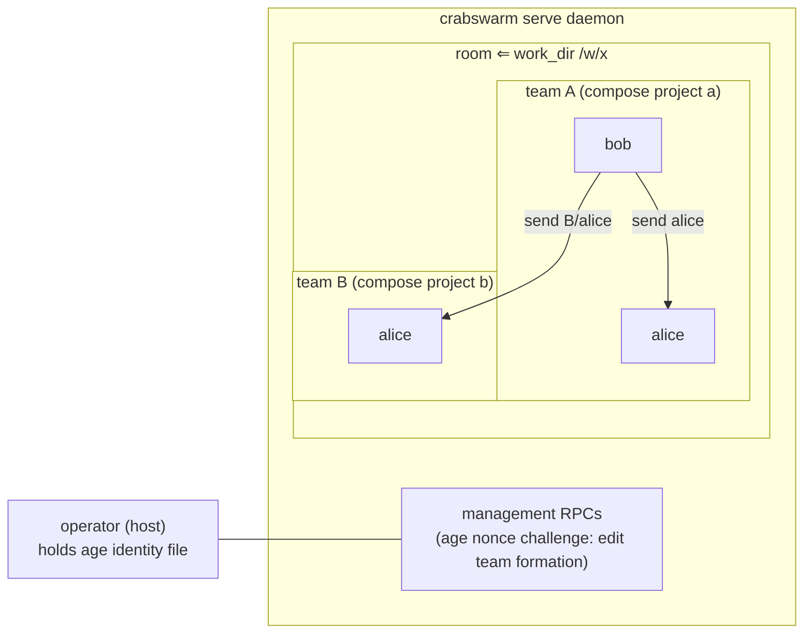

# IDEA — `crabswarm chat`: rooms, teams, join-based messaging

Gate: confirmed by user, 2026-08-27

## One-line statement

`crabswarm chat` lets participants join **rooms** through a `join`
subcommand and exchange messages, with a `serve`d daemon brokering delivery;
a room is split into **teams** that act as name namespaces — any room member
can talk to any other, addressing colliding names as `<team>/<name>`.

## How it should be

- A daemon ("serve") owns rooms and message routing. Participants do not talk
  peer-to-peer; everything goes through the daemon.
- A participant joins via the `join` subcommand — but joining is
  **provider-gated**: the daemon accepts a join only when a **team-info
  provider** already knows the joiner. The sole provider is the
  **cmdman-compose provider**, which resolves the reported
  `$CMDMAN_CMD_ID` to work_dir ⇒ room and compose project ⇒ team. A token
  with no prior team-coordination information is rejected. More provider
  types are conceivable but not planned (D11).
- A room is **where teams can talk**: any member of a room can talk to any
  other member. A team is a **name namespace**, not a wall — names are
  unique within a team, may collide across teams, and a colliding name is
  addressed cross-team as `<team>/<name>`. Nothing besides naming
  separates members within a room (D10, superseding D4's strict scoping).
- Team formation is **not** in participants' hands. Only the daemon edits
  it — automatically (a cmdman compose project's **work_dir determines the
  room**, and the compose project forms a team inside it) or via
  **management RPCs** usable only outside devenv containers, gated by an
  age-key nonce challenge (D4, D7, D10).
- Leaving is as easy as joining ended (Ctrl-C / process exit), and the room
  reflects departure promptly.

## Relation to the agent_swarming plan (RESOLVED Q1 → D1: supersede)

`doc/plan/2026-06-27-01-agent_swarming` (finalized, **not implemented**)
designed a team-scoped inbox messenger:

> D8: `crabswarm swarm send|inbox|members`; bundled skill `crabswarm-chat`
> D11: a team is the cmdman compose project an agent launched under
> (`Send`/`ListMembers` restricted to the same team; cross-team is disabled).

**Decision (D1):** this `chat` plan supersedes that messenger design; the old
plan is retired. Its D11 intuition survives in evolved form — teams are still
daemon-assigned from the launch environment (same cmdman compose project /
same work_dir ⇒ same team), never chosen by the participant (see Q4
resolution).

## Use cases (participants: both humans and agents, agents primary — D2)

### UC1 — Operator starts the chat daemon

- **Actor:** a human operator (or supervising process) on the host.
- **Situation:** about to launch a swarm of agents that should coordinate.
- **Intent:** have a broker running before participants join.
- **Walkthrough:** runs the existing `crabswarm serve` — the chat service is
  registered on the same daemon/socket (D3); daemon listens; logs say it is
  ready; a second serve attempt fails fast (existing flock behavior in
  `crabswarm/server/server.go`).

### UC2 — Participant joins a room and talks

- **Actor:** an LLM agent session or a human in a terminal (D2).
- **Situation:** daemon is running; the participant knows the room name.
- **Intent:** coordinate with teammates.
- **Walkthrough:** runs `crabswarm chat join` with a name — join
  **declares attendance** and returns (no long-lived session); the daemon
  looks the reported `$CMDMAN_CMD_ID` up in the cmdman-compose provider
  and derives room (work_dir) and team (compose project) from it; a token
  the provider does not know is rejected outright (D4, D10, D11). Join is
  typically wired into the harness's session-start hook, which Claude
  Code's agents system can fire more than once — so a repeated join with
  the same token is an idempotent no-op success (D12). Messages are then read
  through a **one-shot command** and sent through another; agents drive
  both via a bundled skill. Agents may fetch proactively, but messages often arrive while the
  agent is not looking — so a **notification mechanism** tells the agent
  "you have messages" **(rough spot — Q9: per-agent notification adapters
  for Claude Code / Codex / OpenCode; research in flight)**.

### UC3 — Teams namespace names within a shared room

- **Actor:** two teams inside one room (e.g. two compose projects sharing
  a work_dir).
- **Intent:** everyone in the room can coordinate; teams keep naming sane.
- **Walkthrough:** a member addresses a teammate by bare name; when the
  same name exists in another team, the other team's member is addressed
  as `<team>/<name>`; a member listing shows the whole room with team
  prefixes where needed. No send is blocked by team boundaries — teams
  separate names, nothing else (D10).

### UC4 — Operator edits team formation from outside

- **Actor:** a human operator on the host (outside devenv containers).
- **Situation:** the automatic same-work_dir grouping needs adjusting —
  e.g. moving a member, merging teams.
- **Intent:** reshape teams without restarting the daemon or participants.
- **Walkthrough:** runs management subcommands whose access is gated by an
  **age identity file on host disk** — devenv mounts do not inherit it, so
  agents inside containers cannot pass the daemon's nonce challenge even
  though they share the socket (D7); changes take effect for subsequent
  delivery.

## Usability requirements

- **Ergonomics:** `crabswarm chat join` is the whole incantation for the
  common case; name/socket come from flags with sensible defaults (socket
  from the layered config, as every other subcommand does). No `--team`
  flag: teams are daemon-assigned (D4).
- **Defaults:** for cmdman-launched agents, room (work_dir) and team
  (compose project) are derived automatically; the participant never has
  to know or state either to join. A non-cmdman participant (e.g. a human
  on the host) has no provider entry, so a plain join is rejected (D11);
  tentative default — they enter through the management-authenticated path
  (age challenge, D7) as an explicitly registered member, choosing a room. Addressing defaults to the bare name,
  with `<team>/<name>` only when names collide across teams (D10).
- **Feedback:** join confirms room/team/name immediately; message delivery
  and member presence changes are visible without asking.
- **Failure experience:** daemon not running → an error naming the socket
  path and suggesting the serve command; join with a token no team-info
  provider knows → clear rejection saying the daemon has no team
  coordination information for it (D11); duplicate join with the same
  token → idempotent no-op success (D12); duplicate participant name in a
  team (different tokens) → clear rejection at join time, not silent
  aliasing.
- **Discoverability:** `crabswarm chat --help` explains the room/team model
  in a paragraph; a way to list rooms/members exists for orientation.

## Resolved (idea-level)

1. **Relation to agent_swarming** → **supersede** (D1).
2. **Who participates** → **both humans and agents, agents primary** (D2).
3. **Serve placement** → **extend existing `crabswarm serve`** (D3).
4. **Team semantics** → revised at the idea gate: **teams are name
   namespaces inside a room, not visibility walls** — any room member can
   talk to any other; colliding names are addressed as `<team>/<name>`;
   for cmdman compose projects, work_dir ⇒ room and compose project ⇒
   team, automatically. Formation stays daemon-controlled only, edited via
   host-only management access (D4 formation clauses + D10; mechanism
   refined by D7).
5. **Interaction model of `join`** → **join declares attendance** (one-shot
   registration, no long-lived session); messages are read and sent through
   one-shot commands; agents use the plain CLI guided by a bundled skill,
   fetching proactively when they think of it, pushed by notification
   otherwise (D5; notification mechanism itself is Q9).

6. **Transport scope** → **UDS only** (D6).
8. **Team identity of joiners** → **`$CMDMAN_CMD_ID` as token** — devenv
   forwards it into containers; the client reports it on every request;
   the daemon resolves it to member → work_dir ⇒ room, compose project ⇒
   team (D8, D10).
10. **Provider-gated join** → the daemon validates every join against a
    **team-info provider**; unknown joiners are rejected. Sole provider:
    cmdman-compose. Extensible in concept, no other provider planned
    (D11).
11. **Duplicate join** → idempotent: a repeated join with the same token
    is a no-op success, tolerating multi-fired session-start hooks (D12).
9. **Message-arrival notification** → **per-harness notifier adapters
   with keystroke fallback** — Claude Code: cross-session messaging
   socket (idle push); OpenCode: HTTP server API (idle push); Codex /
   unknown: cmdman `send-keys`; turn-boundary hooks reinforce where
   supported (D9; details in notification_mechanisms.md).

7. **Management access** → **age identity + nonce challenge** — management
   RPCs on the main socket; access gated by possession of an age identity
   file on host disk that devenv mounts do not inherit; the daemon
   encrypts a nonce to the configured admin recipient, the CLI decrypts
   and echoes it (D7).

## Open questions (idea-level)

None — all resolved (D1–D9).
