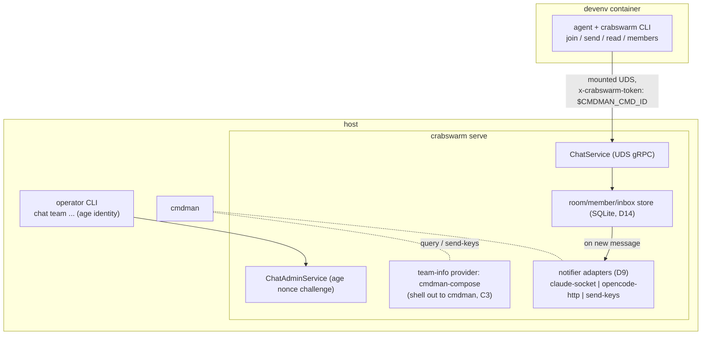

# PLAN — `crabswarm chat` subcommand (rooms, teams, join)

**Summary:** add a `chat` subcommand family where the existing `crabswarm
serve` daemon brokers rooms, participants declare attendance via
`crabswarm chat join` (provider-gated, idempotent), exchange messages via
one-shot verbs with `<team>/<name>` addressing, and idle agents are nudged
through per-harness notifier adapters.

Idea gate: confirmed 2026-08-27 (see IDEA.md). Decisions D1–D12 in
DECISION.md govern; notification research in notification_mechanisms.md.

## Goal / success criteria (from IDEA.md)

- The existing `crabswarm serve` daemon brokers chat (D3).
- `crabswarm chat join` declares attendance; the join is provider-gated
  (D11): the cmdman-compose provider resolves `$CMDMAN_CMD_ID` to
  work_dir ⇒ room and compose project ⇒ team, and unknown tokens are
  rejected. Repeated join with the same token is a no-op success (D12).
- Any two room members exchange messages via one-shot commands; colliding
  names resolve via `<team>/<name>` addressing (D10).
- Idle agents are nudged on arrival via the cmdman `send-keys` notifier
  (D9 interface, D19 v1 scope; native adapters spun off to the
  chat_channels_spike plan).
- Team formation edits are host-only, gated by the age nonce challenge (D7).
- Success = e2e test (repo convention, `e2e/crabswarm`) covering in-room
  delivery, room broadcast, name-collision addressing, cross-room
  isolation, double-join idempotency, unknown-token rejection, and the
  human register-then-participate path.

## Scope

- New proto services under
  `api/schema/proto/ngicks/crabswarm/chat/v1/` (D17), **plus renaming the
  existing proto packages** (`crabhook.v1`, `crabpreview.v1`,
  `sdktypes.v1`) to the `ngicks.crabswarm.<area>.v1` convention with all
  codegen/imports (Go + web TS) updated (D17).
- Cobra wiring: `cmd/crabswarm/commands/chat.go` + one file per verb,
  following the `git.go`/`git_*.go` parent-child registration pattern in
  `cmd/crabswarm/commands/root.go`. (Implementers: the `go-edit-cobra`
  skill auto-triggers under `./cmd`.)
- Server-side room/member/message state + cmdman-compose provider +
  notifier adapters, in a new `crabswarm/chat/` package; service
  registered beside `AuditService` in `crabswarm/server/server.go`.
- Nested `Chat` sub-config in `crabswarm/config.go` (pattern: `HookExec`,
  `Preview`).
- Claude Code plugin/skill deliverables: session-start hook join wiring +
  `crabswarm-chat` skill content (read/send etiquette, notification loop).

## Non-goals

- Cross-room messaging.
- Multi-machine transport (D6: UDS only).
- Hardening the `$CMDMAN_CMD_ID` token against a hostile client (D8:
  cooperative single-host trust).
- Additional team-info provider types beyond cmdman-compose (D11c).
- Team-scoped broadcast (D15 adds room broadcast only; team broadcast is
  future work).

## Context

- `crabswarm serve` (`cmd/crabswarm/commands/serve.go` →
  `crabswarm/server/server.go`): UDS gRPC server, flock single-instance,
  currently hosts only `crabhook.v1.AuditService`.
- Proto style reference: `api/schema/proto/crabpreview/v1/preview_service.proto`
  (commented RPCs, server streaming used for watch).
- Layered config in `crabswarm/config.go` (defaults < file < env < flags).
- cmdman is **external** to this repo. The provider shells out to it; the
  exact query surface is an implementation-time confirmation (C3), carried
  forward from the retired swarm plan.
- Harness notification facts: notification_mechanisms.md (verified
  2026-08-26).

## Approach



- **One package, `crabswarm/chat/`**: SQLite-backed store (rooms → teams
  → members → inboxes; survives daemon restarts, D14), provider interface
  + cmdman-compose implementation, notifier interface + adapters, gRPC
  service impl, admin challenge logic.
- **Identity**: every RPC carries a token as metadata
  (`x-crabswarm-token`) — `$CMDMAN_CMD_ID` for agents, the daemon-issued
  token for admin-registered humans (D16). The server interceptor resolves
  it via the provider **or** the registered-member table and rejects
  tokens known to neither (D8, D11, D18 reconciliation).
- **Delivery**: `Send` resolves the address (bare name in own team first,
  then unique-in-room; `<team>/<name>` for explicit/colliding) and appends
  to the recipient's inbox; `Broadcast` appends to every room member's
  inbox (D15); the notifier then nudges each recipient's harness (D9).
  `Read` drains the caller's pending messages from the SQLite store (D14).
- **Admin**: `GetNonce` returns a nonce encrypted to the configured age
  recipient; subsequent admin RPCs carry the decrypted nonce (D7).
  Implemented with `filippo.io/age`.
- **Rejected alternatives**: separate chat daemon (D3), long-lived
  streaming session (D5), strict team walls (superseded by D10), second
  management socket / ssh signatures (D7).

## Public surface delta

Authoritative enumeration. Anything user-visible not listed here is out of
scope.

### Proto (new file `api/schema/proto/ngicks/crabswarm/chat/v1/chat_service.proto`)

Existing packages are renamed to the same convention (D17):
`crabhook.v1` → `ngicks.crabswarm.hook.v1`, `crabpreview.v1` →
`ngicks.crabswarm.preview.v1`, `sdktypes.v1` →
`ngicks.crabswarm.sdktypes.v1`.

```proto
syntax = "proto3";
package ngicks.crabswarm.chat.v1;
option go_package = ".../api/gen/proto/go/ngicks/crabswarm/chat/v1;chatv1";

// All member-facing RPCs carry metadata "x-crabswarm-token" = $CMDMAN_CMD_ID.
service ChatService {
  // Join declares attendance. Provider-gated (unknown token => NotFound);
  // idempotent per token (repeat => success, no side effects).
  rpc Join(JoinRequest) returns (JoinResponse);
  // Send delivers a message to one addressed member in the caller's room.
  rpc Send(SendRequest) returns (SendResponse);
  // Broadcast delivers a message to every member of the caller's room (D15).
  rpc Broadcast(BroadcastRequest) returns (BroadcastResponse);
  // Read returns (and consumes, pending C2) the caller's pending messages.
  rpc Read(ReadRequest) returns (ReadResponse);
  // ListMembers lists the caller's whole room with team-qualified names.
  rpc ListMembers(ListMembersRequest) returns (ListMembersResponse);
  // Leave withdraws attendance. The daemon also lazily reaps a member
  // whose token no longer resolves via the provider (D18).
  rpc Leave(LeaveRequest) returns (LeaveResponse);
  // ReportState records the member's harness state (working | waiting |
  // done, aligned to `cmdman status set` per D21), fed by harness hooks;
  // the send-keys notifier only nudges done members (D20).
  rpc ReportState(ReportStateRequest) returns (ReportStateResponse);
}

service ChatAdminService {
  // GetNonce returns a nonce encrypted to the configured age recipient (D7).
  rpc GetNonce(GetNonceRequest) returns (GetNonceResponse);
  // Admin RPCs below require the decrypted nonce.
  rpc ListRooms(ListRoomsRequest) returns (ListRoomsResponse);
  rpc MoveMember(MoveMemberRequest) returns (MoveMemberResponse);   // team edit (D4b-d)
  rpc RegisterMember(RegisterMemberRequest) returns (RegisterMemberResponse); // human join path (C5)
}

message Member {
  string name = 1;   // unique within a team (D10b)
  string team = 2;
  string room = 3;
}
message Message {
  Member from = 1;
  string text = 2;
  google.protobuf.Timestamp sent_at = 3;
}
message JoinRequest  {
  string name = 1;             // room/team come from the provider
  // Fields 2-3 reserved for self-reported native notify endpoints
  // (deferred with the native adapters to chat_channels_spike, D19).
  reserved 2, 3;
}
message JoinResponse { Member self = 1; }
message SendRequest      { string to = 1; string text = 2; } // "name" or "team/name"
message BroadcastRequest { string text = 1; }                // whole room (D15)
message ReadRequest  {}
message ReadResponse { repeated Message messages = 1; }
```

(Field-level tweaks during implementation are fine; RPC set and addressing
contract are fixed.)

### CLI (files `cmd/crabswarm/commands/chat*.go`)

```console
$ crabswarm serve                              # ChatService registered on the existing daemon (D3)
$ crabswarm chat join [--name N]               # attendance; room/team via provider (D5/D11/D12)
$ crabswarm chat send <name|team/name> <text>  # one-shot send within the room (D10)
$ crabswarm chat broadcast <text>              # one-shot: to the whole room (D15)
$ crabswarm chat read                          # one-shot: print pending messages (D5)
$ crabswarm chat members                       # list room members, team-qualified
$ crabswarm chat leave
$ crabswarm chat team list|move ...            # admin: age-gated team formation (D4/D7)
$ crabswarm chat register --room R --name N    # admin: register a human, prints token (D16)
# member verbs read the token from $CMDMAN_CMD_ID, overridable via
# $CRABSWARM_CHAT_TOKEN or --token (humans use the printed token)
```

### Config (nested sub-config in `crabswarm/config.go`)

```yaml
chat:
  # Age recipient (public key) the daemon encrypts admin nonces to (D7).
  admin_recipient: "age1..."
  # Path to the age identity file the admin CLI reads (host-only; devenv
  # mounts must not include it) (D7).
  admin_identity_file: "~/.config/crabswarm/chat_admin.key"
  # Path of the SQLite database backing rooms/members/inboxes (D14).
  db: "~/.local/state/crabswarm/chat.db"
  # Notifier (D9/D19): v1 has only the cmdman send-keys adapter; no
  # per-adapter keys yet. Native-adapter config keys arrive with the
  # chat_channels_spike outcome.
  notify: {}
```

### Env / metadata

```text
$CMDMAN_CMD_ID              # forwarded into containers by devenv; sent as
                            # gRPC metadata x-crabswarm-token on every RPC (D8)
$CRABSWARM_CHAT_TOKEN       # overrides the token; how an admin-registered
                            # human presents their daemon-issued token (D16).
                            # Every member verb also accepts --token.
```

### Plugin / skill

```text
plugin: SessionStart hook   -> crabswarm chat join   (idempotent, D12)
plugin: Stop hook           -> inbox check reinforcement (D9, turn-boundary)
skill:  crabswarm-chat      -> how to send/read/members, addressing rules,
                               etiquette
```

## Implementation steps

Each step is independently verifiable; later steps depend on earlier ones.

1. **Proto rename + chat schema.** Rename existing packages to
   `ngicks.crabswarm.<area>.v1` (move files under
   `api/schema/proto/ngicks/crabswarm/`, update `go_package`, regenerate
   Go + TS, fix imports in `crabswarm/`, `cmd/`, `pkg/claudehook`, and
   `web/`); add
   `api/schema/proto/ngicks/crabswarm/chat/v1/chat_service.proto` per the
   surface delta. Verify with full build + web e2e. Delivers: D17; D10b
   addressing vocabulary, D11a rejection shape, D12 idempotent Join
   contract, D7 nonce RPCs, D15 Broadcast RPC.
2. **Store.** `crabswarm/chat/store.go`: SQLite-backed (modernc driver)
   rooms/teams/members/inboxes with the collision rules (unique name per
   team; `<team>/<name>` resolution; bare-name own-team-first), a member
   state column (working/waiting/done per D21, D20a), and the `chat.db`
   config key. Unit tests for resolution, double-join no-op, and restart
   survival. Delivers: D10 (a)–(c), D12, D14, D20 (a) storage.
3. **Provider.** `crabswarm/chat/provider.go`: `TeamInfoProvider`
   interface + cmdman-compose implementation (shell out; C3 confirmation
   lands here) mapping token → {room=work_dir, team=compose project}.
   Delivers: D11 (a)–(b), D8 (c).
4. **Service + interceptor.** `crabswarm/chat/service.go`: ChatService
   impl (Join/Send/Broadcast/Read/ListMembers/Leave/ReportState); token
   interceptor
   resolving via provider or registered-member table (D8 (a)–(b), D16);
   lazy reap on failed provider lookups for provider-originated members
   only (D18 + reconciliation); register beside `AuditService` in
   `crabswarm/server/server.go`. Delivers: D3, D11a, D15, D16
   (resolution side), D18.
5. **Admin service.** `crabswarm/chat/admin.go`: age nonce challenge
   (`filippo.io/age`), `ListRooms`/`MoveMember`/`RegisterMember`; config
   keys `chat.admin_recipient` / `chat.admin_identity_file` in
   `crabswarm/config.go`. Delivers: D7 all clauses, D4 (b) and (d) manual
   path, D16 (RegisterMember human path).
6. **Notifier.** `crabswarm/chat/notify.go`: `Notifier` interface (kept
   pluggable per D9) with **only the cmdman `send-keys` adapter in v1**
   (D19), gated per D20: inject only into members whose reported state is
   done (D21), and capture-pane + dialog-marker text scan immediately before
   injection. Member state column + `ReportState` handling land with
   steps 2/4. Native adapters (claude, opencode, channel-server) are spun
   off to `doc/plan/2026-08-27-01-chat_channels_spike` — see HANDOFF.md.
   Background in notification_mechanisms.md. Delivers: D9 (interface +
   fallback adapter), D19, D20 (b)–(c).
7. **CLI.** `cmd/crabswarm/commands/chat.go` + `chat_join.go`,
   `chat_send.go`, `chat_broadcast.go`, `chat_read.go`,
   `chat_members.go`, `chat_leave.go`, `chat_team.go`,
   `chat_register.go` (+ subfiles), following the git.go registration
   pattern; token sourcing `$CMDMAN_CMD_ID` / `$CRABSWARM_CHAT_TOKEN` /
   `--token` (D8b, D16). Delivers: D5 (a)–(c), D10b addressing UX, D15
   broadcast verb, D16 human-side verbs, D7 admin CLI side.
8. **Plugin/skill + hook wiring, per harness.** Claude Code: plugin under
   `plugin/` with SessionStart-hook join, Stop-hook inbox reinforcement,
   a PostToolUse `additionalContext` unread-message hint (mid-task
   delivery), and state reporting via `Notification`/`Stop`/
   `UserPromptSubmit` hooks (hook-complete, D20). Codex: `hooks.json`
   wiring — `SessionStart` join, PostToolUse hint, and
   `UserPromptSubmit`/`PermissionRequest`/`PostToolUse`/`Stop` state
   reporting (D20a). **Codex hook behaviors are recent and thinly
   documented (Stop-block is third-party-documented only): verify each
   empirically at this step, and design hooks so a broken one degrades to
   late delivery, never lost messages.** `crabswarm-chat` skill content
   shared across harnesses. Delivers: D5c, D9 turn-boundary + mid-task
   reinforcement, D12 consumer side, D20 (a).
9. **e2e.** `e2e/crabswarm/chat_test.go`: in-room delivery, room
   broadcast (D15), collision addressing, cross-room isolation,
   double-join idempotency, unknown-token rejection, human
   register-then-send (D16, incl. not being reaped), admin nonce
   round-trip. Delivers: success criteria.

## Testing and verification

- Unit: store resolution/collision/idempotency; provider parsing; age
  challenge round-trip; notifier dispatch against a fake Notifier
  (step 6).
- e2e per step 9 (fake cmdman via a stub binary on PATH, same technique
  as the provider's C3 seam).
- Manual: two terminals + a fake `$CMDMAN_CMD_ID` provider stub.

## Risks

- cmdman query surface mismatch (C3) — provider is behind an interface so
  only step 3 absorbs the change.
- `send-keys` nudges are brittle (terminal state, no ack) and are v1's
  only channel (D19); the chat_channels_spike plan owns the sturdier
  replacements.

## Resolved (contract-level)

- **C1** → mount endpoints out; native adapters in v1, `send-keys`
  fallback (D13).
- **C2** → SQLite-backed inbox store (D14).
- **C4** → directed + room broadcast (D15).
- **C5** → humans admin-registered via age-gated RegisterMember (D16).
- **C6** → `ngicks.crabswarm.chat.v1`; existing proto packages renamed to
  the same convention (D17).
- **C7** → explicit Leave + lazy reap on failed provider lookups (D18).

## Traceability (decision clause → owning step)

| Decision clause | Owner |
| --- | --- |
| D1 supersede swarm plan | done at planning time (old STATUS.md marked superseded) |
| D2 agents primary / humans too | steps 7, 8 / D16 → step 5 |
| D3 extend `crabswarm serve` | step 4 |
| D4 (b) no participant team choice | steps 1, 4 (no team field in Join) |
| D4 (c) auto compose/work_dir assignment | step 3 |
| D4 (d) formation edits mgmt-only | step 5 |
| D5 (a) join = one-shot attendance | steps 1, 7 |
| D5 (b) one-shot read/send | step 7 |
| D5 (c) CLI + skill for agents | step 8 |
| D5 (d) arrival notification required | step 6 |
| D6 UDS only | step 4 (existing listener; none added) |
| D7 age nonce challenge (all clauses) | steps 1, 5, 7 |
| D8 (a) devenv forwards env var | external (devenv) — C3 confirmation |
| D8 (b) client sends token | step 7 |
| D8 (c) daemon resolves token | steps 3, 4 |
| D9 notifier interface + send-keys | step 6 (v1 per D19); turn-boundary reinforcement step 8 |
| D9/D13 native adapters | spun off to chat_channels_spike plan (D19, HANDOFF.md) |
| D10 (a) room-wide visibility | steps 2, 4 |
| D10 (b) name namespace + `team/name` | step 2 |
| D10 (c) nothing else separates | steps 2, 4 |
| D10 (d) work_dir ⇒ room, compose ⇒ team | step 3 |
| D11 (a) unknown join rejected | steps 3, 4; e2e step 9 |
| D11 (b) sole provider cmdman-compose | step 3 |
| D11 (c) extensible, none planned | step 3 (interface); non-goal |
| D12 double-join no-op | steps 2, 9 |
| D13 mounted endpoints (superseded by D19 for v1) | chat_channels_spike plan |
| D19 send-keys-only v1 | step 6 |
| D20 (a) hook-fed state reporting | steps 2 (state column), 4 (ReportState), 8 (hook wiring) |
| D20 (b) idle-only injection | step 6 |
| D20 (c) capture-pane snapshot guard | step 6 (+ C3: exact cmdman capture surface) |
| D14 SQLite inbox | step 2 |
| D15 room broadcast | steps 1, 4, 7; e2e step 9 |
| D16 human RegisterMember + token use | steps 5, 4 (resolution), 7 (--token/env); e2e step 9 |
| D17 proto rename + chat package | step 1 |
| D18 leave + lazy reap (provider members only) | step 4 |

IDEA.md use cases replayed: UC1 → step 4; UC2 → steps 1–4, 7, 8; UC3 →
steps 2, 7; UC4 → steps 5, 7. All delivered.

## Open questions (contract-level)

3. **C3 — cmdman query surface.** Exact CLI to resolve
   `$CMDMAN_CMD_ID` → {work_dir, compose project}, to `send-keys`, and to
   **capture-pane** for the D20 snapshot guard. External to this repo.
   *Implementation-time confirmation with the user at steps 3/6; the
   provider and notifier interfaces isolate it.*
