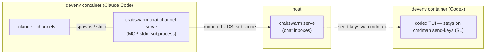

# IDEA — native notify spike: Claude Channels

Gate: not confirmed

## One-line statement

Replace the chat notifier's brittle `send-keys` nudges for **Claude Code**
with a crabswarm-owned **channel server** speaking the openly specified
Channels contract — so message-arrival events reach Claude agents through
a documented protocol instead of typed keystrokes. (Codex stays on
`send-keys` by user decision S1; its app-server notes below are context
only.)

## Origin

Spun off from `doc/plan/2026-08-26-01-chat_subcommand` by its D19 ("For
now we'll implement send-keys provider only. Spawn another plan about
Channels so another session can spike on it."). That plan's
`notification_mechanisms.md` holds the verified research this spike builds
on; its HANDOFF.md entry 1 defines what this plan owns. This is a
**spike**: the deliverable is a working prototype plus a
recommendation, not production integration.

## How it should be

### Track A — crabswarm as a Claude Code channel server (primary)

- A channel is an MCP server Claude Code spawns as a **local subprocess
  over stdio**; delivery never touches Anthropic infra. The contract is
  openly specified: declare `capabilities.experimental['claude/channel']`,
  emit `notifications/claude/channel`; reply tools and permission relay
  are also specced. Any language qualifies — a Go binary works.
  Ref: https://code.claude.com/docs/en/channels-reference
- crabswarm itself should be the channel server — e.g.
  `crabswarm chat channel-serve`: launched by Claude Code inside the
  devenv container, it dials the daemon over the already-mounted UDS,
  subscribes to arrival events for its member, and pushes them into the
  session; ideally it also exposes a reply tool so the agent answers
  without shelling out.
- This **inverts the container-boundary problem** the chat plan's D13
  tried to solve by mounting endpoints out: the channel connects outward;
  nothing needs mounting toward the host.
- **Known preview blockers** (why this is a spike, not a v1 adapter):
  channels require Anthropic auth (feature-flag gating of the research
  preview — not message routing), the `--channels` flag at launch, and a
  custom channel needs `--dangerously-load-development-channels` plus an
  interactive full-screen confirmation dialog on every launch — hostile
  to automated agent spawning. The org escape hatch
  (`allowedChannelPlugins`) exists only under Team/Enterprise managed
  settings. Flag syntax and contract "may change based on feedback."

### Track B — Codex app-server (RESOLVED Q1 → S1: OUT of scope; context only)

**Codex remains on the `send-keys` fallback for now (S1).** The facts
below are preserved as context for whenever Codex-native notification is
revisited; no use case or step in this spike touches them.

- The **Codex app-server protocol** is the official frontend/backend
  split Codex uses "to power rich clients (for example, the Codex VS Code
  extension)": JSON-RPC 2.0, stdio default (newline-delimited JSON;
  WebSocket/unix-socket transports experimental), with `thread/start`,
  `thread/resume`, `thread/fork`, `turn/start`, `turn/steer` (inject into
  an in-flight turn), `thread/inject_items`.
  Ref: https://learn.chatgpt.com/docs/app-server ,
  https://github.com/openai/codex/blob/main/codex-rs/app-server/README.md
- Hard constraint: app-server controls **only sessions it spawned** — no
  cross-process attach to a separately running Codex TUI (open request:
  openai/codex#25914). Using it means crabswarm/cmdman **owns the Codex
  session lifecycle**, launching Codex through app-server instead of as a
  TUI — a launch-architecture question for cmdman/devenv, not just an
  adapter.
- Also experimental: "The app-server command and WebSocket transport are
  experimental and aren't supported for production workloads."

## Use cases

### UC1 — Claude agent gets a chat message while idle

- **Actor:** a Claude Code agent session in a devenv container, chat
  member via the chat plan's join flow.
- **Walkthrough:** a teammate sends it a message; the daemon marks the
  inbox; the channel server (subscribed over the mounted UDS) emits a
  `notifications/claude/channel` event; the idle session starts a turn,
  reads the event, runs `crabswarm chat read`, acts, and replies — via
  the channel's reply tool or `chat send`.

### UC2 — Operator evaluates whether Channels can replace send-keys

- **Actor:** the developer running this spike.
- **Walkthrough:** launches a claude session with the dev flag + the
  crabswarm channel; measures reliability vs. `send-keys` (idle wake,
  busy-turn queueing, transcript cleanliness); documents the launch
  friction (dialog, flags); delivers a go/no-go recommendation with the
  conditions under which the chat plan should adopt it.

## Usability requirements

- Zero per-message human interaction once a session is up; launch-time
  friction (the dev-flag dialog) is acceptable for the spike but must be
  called out in the recommendation.
- The channel server must fail soft: daemon unreachable → log and idle,
  never crash the agent session.
- The spike's outcome must state, concretely, what the chat plan's step 6
  adapter would look like (config keys, JoinRequest fields to un-reserve,
  launch wiring).

## Resolved (idea-level)

1. **Scope of Track B** → **out** — "just for now Codex is only send-keys
   fallback" (S1). This spike is Claude Channels only.

## Open questions (idea-level)

2. **Reply tool scope** — should the channel expose reply (agent answers
   through the channel) or only push arrivals (agent replies via
   `chat send`)? *Tentative default: push-only first; reply tool if time
   permits.*
3. **OpenCode** — its HTTP API is already documented and easy; include a
   third mini-track to prototype the opencode adapter here too, or leave
   it for the chat plan to pick up directly? *Tentative default: leave
   out; it needs no spike.*
4. **Spike deliverable form** — throwaway branch + findings written into
   this plan, or landable `crabswarm chat channel-serve` code behind a
   flag? *Tentative default: findings + prototype on a branch; promotion
   is the chat plan's call.*
