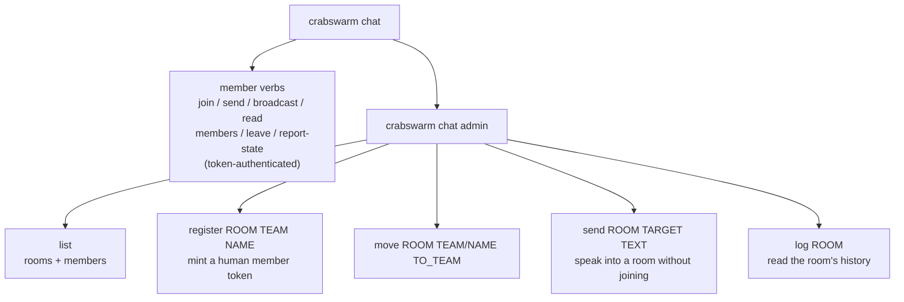
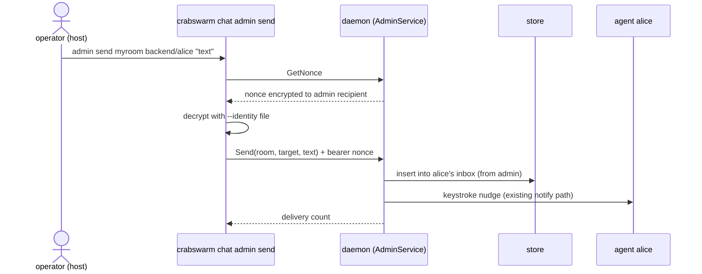

# Idea: `crabswarm chat admin` subcommand

Gate: not confirmed (automatic decisions, pending user review)

## How it should be

The admin is not a member. It authenticates by possessing the host's age
identity file (challenge-response, never a token), it never appears in a
room's member list, it never receives messages in an inbox, and — because
no token ties it to a room — it always names the room it operates on
explicitly. Today the admin verbs (`chat register`, `chat team list`,
`chat team move`) sit mixed among the member verbs under `chat`, which
suggests the admin is just another chat participant. It is not, and the
command tree should say so: everything the admin does lives under one
`crabswarm chat admin` group.

## Use cases

### Operator surveys the swarm

The host operator wants to know which rooms exist and who attends them.
They run `crabswarm chat admin list --identity ~/key.age` and get every
room with its teams and members — same rendering as today's
`chat team list`, one level deeper in the tree and named for what it
lists rather than for "team".

### Operator speaks into a room

An agent is stuck and the operator wants to tell it something without
becoming a member (no join, no inbox, no keystroke nudge aimed back at
their own shell — the hazard recorded in the issue backlog's "Nudge
opt-in kind" entry). They run:

    crabswarm chat admin send myroom backend/alice "stop, wrong branch" \
        --identity ~/key.age

The message lands in alice's inbox attributed to the reserved sender
`admin`, and alice's harness is nudged exactly as for a member's
message. `TARGET` accepts the same address forms as member `chat send`
(`team/name`, bare `name`, `team` for a whole team) plus `*` for the
whole room.

### Operator reviews what was said

The operator suspects two agents talked past each other an hour ago.
`crabswarm chat admin log myroom` prints the room's recent history
(newest last), fed by the per-room history log (sibling plan
`2026-08-31-05-per_room_message_history`). Until that plan lands, the
verb is absent — not stubbed.

### Operator registers a human (unchanged flow, new spelling)

`crabswarm chat admin register myroom backend carol` mints and prints
the one-time token, exactly as `chat register` does today.

## Usability requirements

- **Explicit room everywhere.** Every room-scoped admin verb takes the
  room as its first positional argument. No verb infers a room; the
  admin holds no token to infer from.
- **One auth flag.** `--identity` (already a persistent flag on `chat`)
  is the only credential; every admin verb performs its own
  challenge-response round, as today.
- **No member side effects.** Admin never joins, never appears in
  `chat members` output, never has state, is never nudged.
- **Old spellings are gone.** `chat register` and `chat team` are
  removed, not aliased — the app has never been deployed and stale
  duplicate paths are worse than a clean break.
- **Failure experience.** A missing/wrong identity file keeps today's
  targeted error and hint (`crabswarm/chat/cli/admin.go:36-38,73-77`).
  `admin log` on a room with no history says so plainly rather than
  printing nothing.
