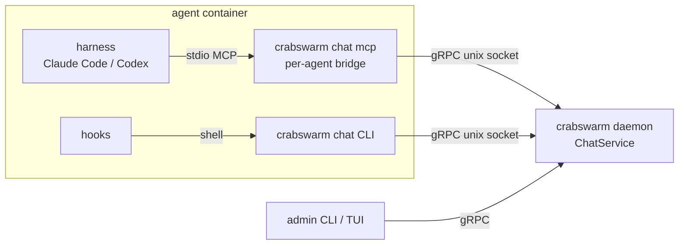
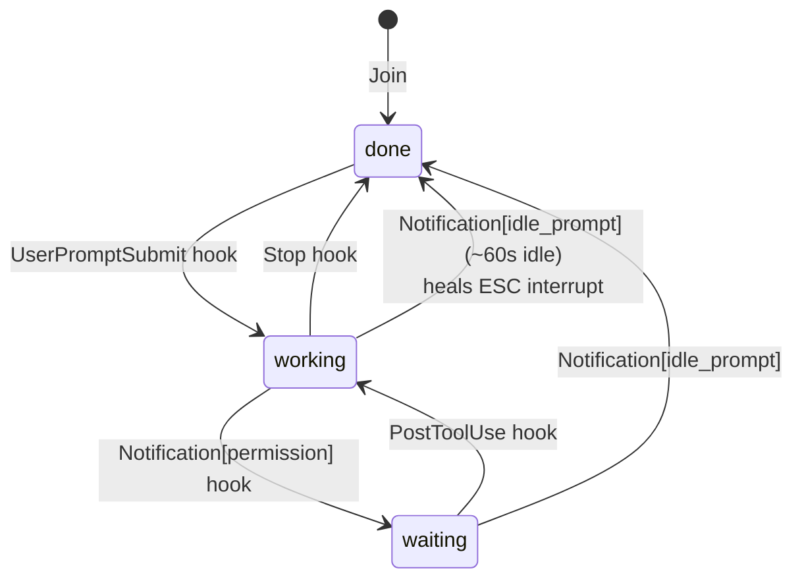

# Chat MCP server — how it should be

Gate: not confirmed (automatic decisions, pending user review)

Native notification and hook methods vary between harnesses (Claude Code
hooks, Codex notify, whatever comes next). The chat side should therefore
speak MCP — the one protocol every harness already implements as a client —
while every existing CLI verb keeps working, because hooks can only shell
out and humans still want the CLI.

## Shape

One MCP server instance corresponds to one agent. The harness spawns it as
a stdio MCP server; it auto-joins the room at startup on the agent's
behalf and bridges everything else to the central daemon. Because
`Service.Join` is idempotent for a known token
(`crabswarm/chat/service_member.go`), several MCP server instances inside
the same container coexist without coordination.



## Use cases

### Agent sends and reads chat through tools

- Actor: a coding agent mid-turn.
- Situation: it wants to ask a teammate something or drain its inbox.
- Intent: talk without shelling out to a CLI it may not know the flags of.
- Walkthrough: the agent calls the `chat_send` / `chat_read` MCP tools;
  the bridge forwards to the daemon with the token it resolved at startup;
  the result comes back as the tool result. No token handling, no socket
  path, no flags — the bridge carries all of it.

### Agent joins by merely starting up

- Actor: the harness process manager (cmdman-compose).
- Situation: a fresh agent container starts; its harness spawns configured
  MCP servers.
- Intent: the agent is a room member before its first turn, with zero
  hook wiring needed for join.
- Walkthrough: `crabswarm chat mcp` starts, resolves the token
  (`$CRABSWARM_CHAT_TOKEN` → `$CMDMAN_CMD_ID`, as
  `crabswarm/chat/cli/token.go` does), dials the daemon socket and calls
  `Join`. A second instance (another MCP client config in the same
  container) joins again; the daemon ignores the duplicate.

```mermaid
sequenceDiagram
    participant H as harness
    participant B as chat mcp bridge
    participant D as daemon
    H->>B: spawn (stdio) + initialize
    B->>D: Join(token)
    D-->>B: identity (name, team, room)
    Note over B: ready; tools + resources listed
    H->>B: tools/call chat_send
    B->>D: Send(token, ...)
    D-->>B: ok
    B-->>H: tool result
```

### Agent inspects who is around and what was said

- Actor: an agent catching up on context.
- Intent: see room members with their states, and (once per-room history
  exists) read back the conversation.
- Walkthrough: the agent reads the `crabswarm://chat/members` resource
  (and later `crabswarm://chat/history`); subscribing gets it
  `resources/updated` notifications when a member's state flips or a
  message lands, so a polling loop is never needed.

### State reporting stays hook-driven — by protocol necessity

MCP (spec 2026-07-28) defines no client→server busy/idle push and no
turn-end signal, and Claude Code hooks cannot call MCP tools
(anthropics/claude-code#26112). So `working`/`waiting`/`done` keeps
flowing through hooks shelling out to `crabswarm chat report-state`; the
MCP server does not and cannot replace it. What the MCP server does
replace is the `SessionStart → chat join` hook.

### Interrupted harness recovers its nudges

- Actor: a human pressing ESC mid-turn in Claude Code.
- Situation: "Stop hooks … don't fire on user interrupts"
  (code.claude.com/docs/en/hooks-guide), so today the member state sticks
  at `working` and `notify.SendKeys` (gating on `StateDone`,
  `crabswarm/chat/notify/notify.go`) never nudges that member again.
- How it should be: within about a minute of the harness sitting idle,
  the state heals to `done` and nudges flow again — via the
  `Notification[idle_prompt]` hook (fires ~60s idle) mapped to
  `report-state done`, backed by a staleness fallback in the nudge gate
  so even a missed hook cannot wedge a member forever.



## Usability requirements

- Zero-config for the common case: token from env, socket from the same
  layered config the CLI uses; `claude mcp add crabswarm -- crabswarm
  chat mcp` (or the codex equivalent) must be the whole setup.
- The bridge must fail soft at startup: daemon unreachable or token
  missing degrades to an MCP server whose tools return a clear error,
  not a crashed harness startup.
- Tool names and descriptions are written for the model: short, verbed,
  with the room etiquette (reply expectations) in the description, so the
  crabswarm-chat skill and the tools tell one story.
- CLI verbs never regress: everything the tools do stays doable by hand.
