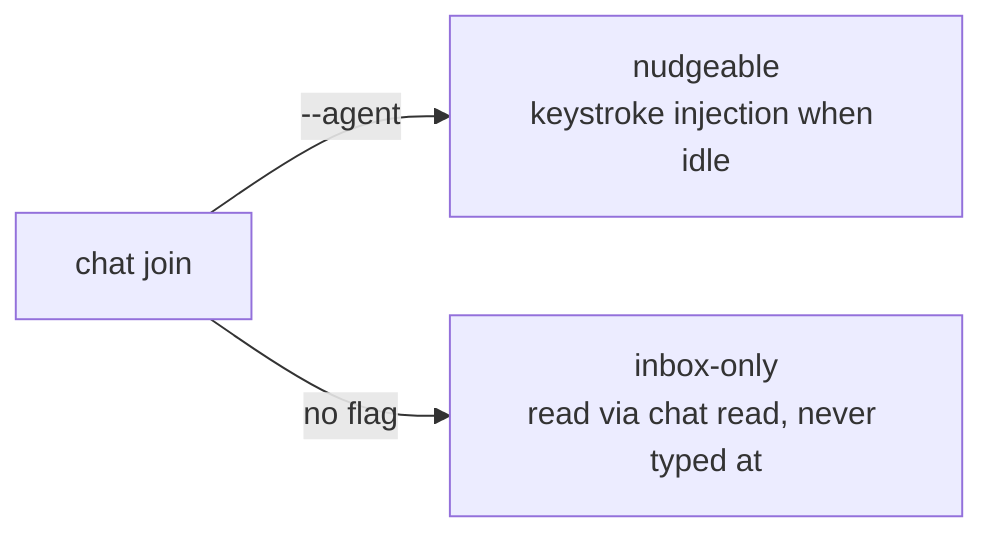

# Nudge opt-in kind for members

Gate: not confirmed (automatic decisions, pending user review)

Status: deferred by user — see DECISION.md D1. Drafted so the context is not
lost when the item comes back.

## How it should be

Keystroke-injection nudges are opt-in, declared at join time. A member that
says "I am an agent harness" (`--agent`) may be typed at when idle; any other
member is inbox-only and its terminal is never touched, no matter how it was
resolved.

Today the opposite holds: every cmdman-resolved member is unconditionally
nudgeable, and the guards cannot tell a Claude/Codex TUI from a plain
interactive shell — so a human joining chat from a cmdman-tracked shell gets
the nudge line plus Enter executed as a shell command.

## Use cases

### Harness agent under cmdman

- Actor: a Claude Code / Codex session launched by cmdman-compose.
- Situation: its SessionStart hook joins chat automatically.
- Intent: receive teammate messages mid-idle without a human relaying them.
- Walkthrough: the hook runs `crabswarm chat join --agent`; the daemon records
  the member as nudge-capable; when a message arrives and the member's state
  is done, the notifier injects the `[crabswarm chat] ...` line into its
  terminal, exactly as today.

### Human (or unknown process) joining from a plain shell

- Actor: a person working in a cmdman-tracked interactive shell.
- Situation: they join the room to talk to the agents.
- Intent: send and read messages; never have text typed into their shell.
- Walkthrough: they run `crabswarm chat join` (no `--agent`); sends addressed
  to them land in the inbox only; they poll with `crabswarm chat read`. The
  notify path declines before ever touching their terminal.

## Usability requirements

- Default is safe: omitting the flag can at worst delay a message (poll to
  read), never execute stray text in a shell.
- The flag lives where identity is declared (`chat join`), not on every send.
- Hook wiring — not humans — is what passes `--agent`, so agents keep the
  current zero-config experience via the apm package.
- `chat members` output should let an operator see which members are
  nudge-capable, so a mis-joined member is diagnosable.
