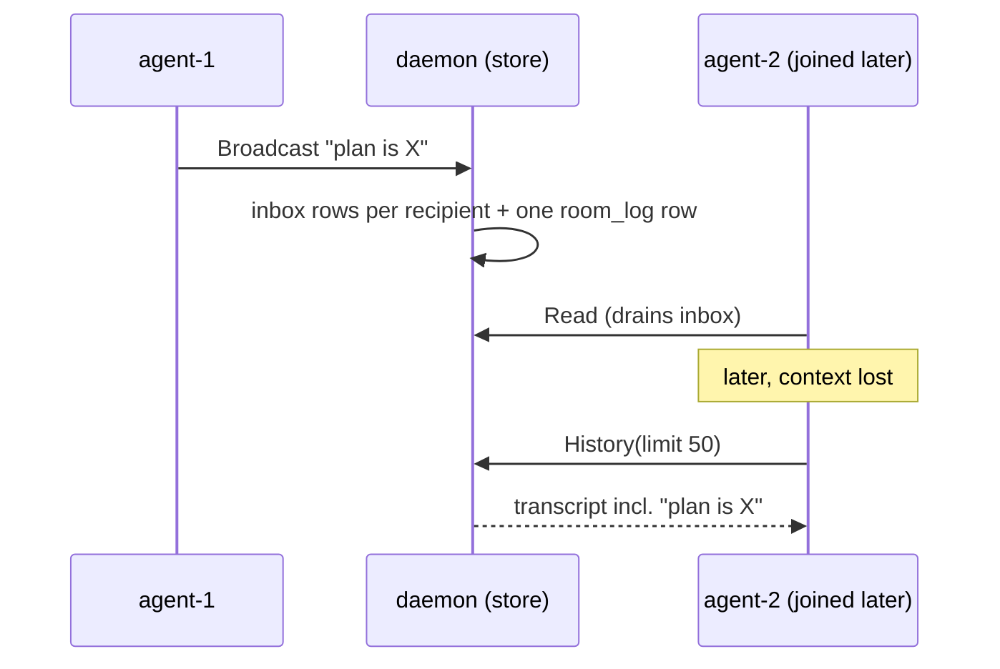

# Per-room message history — how it should be

Gate: not confirmed (automatic decisions, pending user review)

Chat should remember what was said. Today the store is a pure inbox: a
message exists only as per-recipient rows that `chat read` deletes on
delivery (`crabswarm/chat/inbox.go` `Store.Read` →
`q.DeleteMessages`). Once read, the conversation is gone for everyone —
including the member who read it, any member who joined later, and the
admin. The room's conversation is a shared resource and should be kept
as one, bounded so it can never grow without limit.

## Use cases

### A member catches up on the room's conversation

- **Actor**: an agent (or registered human) member holding a chat token.
- **Situation**: it just joined mid-project, resumed after a context
  compaction, or was nudged about a discussion that happened while it
  was busy; its own inbox only ever held messages addressed to it, and
  those are already drained.
- **Intent**: see what the room has been talking about, oldest first,
  without consuming anyone's inbox.
- **Walkthrough**: the member runs `crabswarm chat history` (optionally
  `--limit N`). It gets the last N entries of its own room —
  broadcasts and directed messages alike, each with sender, addressee
  (empty for a broadcast), text, and timestamp — printed oldest first
  so it reads like a transcript. Running it twice prints the same
  thing: history is a non-destructive read, unlike `chat read`. The
  room is implicit — a member's token pins it, so there is nothing to
  specify.

### The admin reviews a room's conversation

- **Actor**: the host operator holding the age admin identity.
- **Situation**: agents in a room went off the rails, or the operator
  wants to see how a task was coordinated after the fact.
- **Intent**: read a named room's transcript without being a member.
- **Walkthrough**: the admin names the room explicitly (admin verbs
  always do) and gets the same transcript view. The verb itself lives
  in the `chat admin` plan (`doc/plan/2026-08-31-01-*`); this plan's
  job is that the history exists, is room-scoped, and is queryable by
  room id so that verb — and the admin TUI's live view, and a future
  MCP resource — have something to read.

## Usability requirements

- **Non-destructive**: reading history never consumes anything;
  `chat read` semantics are untouched.
- **Transcript order**: output is oldest-first within the returned
  window (the *last* N messages, shown in reading order).
- **One row per utterance**: a broadcast appears once in history, not
  once per recipient — history records what was said, delivery records
  who got it.
- **Bounded by default**: retention is capped per room out of the box;
  the cap is configurable like the other chat settings
  (`crabswarm/chat/config.go` pattern: config key + env var), and an
  operator can turn history off entirely.
- **Failure experience**: an unknown token fails like every other
  member verb; a room with no history yet prints nothing and exits
  zero — an empty transcript is not an error.
- **Discoverability**: `chat history` sits beside `chat read` in
  `crabswarm chat --help` with a one-line contrast ("read consumes
  your inbox; history shows the room's recent conversation").
