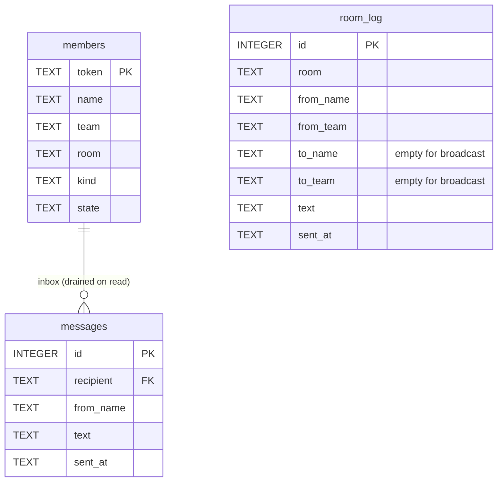

# Per-room message history

Keep an append-only, capped, per-room log of every send/broadcast and
expose it to members as a non-destructive `chat history` verb.

## Goal / success criteria

- Every `Send`/`Broadcast` records exactly one `room_log` row in the
  same transaction that writes the inbox rows.
- `crabswarm chat history [--limit N]` prints the caller's room's last
  N entries (default 50), oldest first, repeatably.
- Retention is capped per room (default 1000 rows), pruned inline, and
  configurable via `chat.history_limit` / `CRABSWARM_CHAT_HISTORY_LIMIT`;
  a negative limit disables logging.
- The store exposes a room-id-keyed read (`Store.History`) usable by
  the admin plane and future MCP resources without member auth.

## Scope

- Schema: new `room_log` table + queries (sqlc).
- Store: log writes in `Store.Send`/`Store.Broadcast`, inline pruning,
  `Store.History` read.
- Proto/service: `ChatService.History` RPC + handler.
- Config: `HistoryLimit` on `chat.Config`/`PartialConfig`.
- CLI: `crabswarm chat history` member verb.
- Tests: store, service, e2e.

## Non-goals

- Admin-facing verb/RPC surface (owned by the `chat admin` plan,
  `doc/plan/2026-08-31-01-*` — this plan only provides `Store.History`).
- MCP resource exposure (owned by `doc/plan/2026-08-31-02-*`).
- Live tailing/streaming (admin TUI plan, `doc/plan/2026-08-31-06-*`,
  decides polling vs streaming on top of this table).
- System events (join/leave/state changes) in the log — messages only.

## Context

- Inbox-only store: `crabswarm/chat/internal/schema/ddl/schema.sql`
  (tables `members`, `messages`),
  `crabswarm/chat/internal/schema/queries/queries.sql`
  (`DeleteMessages` drains on read). sqlc output lives in
  `crabswarm/chat/internal/db` (`sqlc.yaml`: schema dir `ddl`, queries
  dir `queries`; both are directories, so new files are drop-ins;
  `embed.go` concatenates `ddl/*.sql` in filename order).
- Write paths: `Store.Send` / `Store.Broadcast` in
  `crabswarm/chat/inbox.go`, both single-transaction via `s.tx`;
  `appendMessage` writes inbox rows.
- RPC layer: `api/schema/proto/ngicks/crabswarm/chat/v1/chat_service.proto`
  (`ChatService` member RPCs, `Message` has `Sender from`, `text`,
  `sent_at`); handlers in `crabswarm/chat/service_inbox.go`;
  member auth via `s.caller(ctx)`.
- Config pattern: `crabswarm/chat/config.go` (`Config` /
  `PartialConfig` / `Apply`, triple json/yaml/env tags).
- CLI pattern: `cmd/crabswarm/commands/chat_read.go` +
  `dialChatAsMember` in `zz_chat.go`; client methods in
  `crabswarm/chat/cli/`.

## Approach

One `room_log` row per utterance, written inside the existing
send/broadcast transaction, pruned in the same transaction to the
configured per-room cap. Reads are windowed tail queries. Rejected:
per-recipient history rows (duplicates a broadcast N times and couples
history to delivery — D-H2); a separate retention daemon/cron (inline
`DELETE` on insert is simpler and self-maintaining — D-H3); reusing the
`messages` table with a "read" flag (changes `chat read` semantics and
keeps the FK `ON DELETE CASCADE`, which would erase history when a
member leaves — D-H1).



`room_log` deliberately has **no** foreign key to `members`: history
must outlive the members who wrote it (a leaving member's
`ON DELETE CASCADE` erasing the room's transcript would defeat the
point).

## Public surface delta

```sql
-- crabswarm/chat/internal/schema/ddl/room_log.sql (new file; sorts
-- after schema.sql, which it does not depend on)
CREATE TABLE IF NOT EXISTS room_log (
	id        INTEGER PRIMARY KEY AUTOINCREMENT,
	room      TEXT NOT NULL,
	from_name TEXT NOT NULL,
	from_team TEXT NOT NULL,
	to_name   TEXT NOT NULL DEFAULT '',
	to_team   TEXT NOT NULL DEFAULT '',
	text      TEXT NOT NULL,
	sent_at   TEXT NOT NULL
);
CREATE INDEX IF NOT EXISTS room_log_room ON room_log (room, id);
```

```proto
// chat_service.proto additions
service ChatService {
  // History returns the last limit entries of the caller's room's
  // conversation, oldest first. Non-destructive.
  rpc History(HistoryRequest) returns (HistoryResponse);
}
message HistoryRequest {
  // Limit caps the returned window; 0 means the server default (50).
  int32 limit = 1;
}
message HistoryEntry {
  Sender from = 1;
  // To is the addressed member of a directed send; unset for a
  // broadcast.
  Sender to = 2;
  string text = 3;
  google.protobuf.Timestamp sent_at = 4;
}
message HistoryResponse {
  repeated HistoryEntry entries = 1;
}
```

```go
// crabswarm/chat package additions
type Config struct {
	// HistoryLimit is the per-room row cap of the conversation log.
	// 0 means the default (1000); a negative value disables history.
	HistoryLimit int `json:"history_limit" yaml:"history_limit"`
}
type PartialConfig struct {
	HistoryLimit *int `json:"history_limit,omitzero" yaml:"history_limit,omitempty" env:"HISTORY_LIMIT"`
}

// Store additions (crabswarm/chat/inbox.go or history.go)
type HistoryEntry struct {
	From   Sender
	To     *Sender // nil for broadcast
	Text   string
	SentAt time.Time
}
func (s *Store) History(ctx context.Context, room string, limit int) ([]HistoryEntry, error)
```

```console
# CLI addition (member verb)
$ crabswarm chat history            # last 50, oldest first
$ crabswarm chat history --limit 200
```

```yaml
# config example
chat:
  history_limit: 1000   # rows kept per room; -1 disables
# env: CRABSWARM_CHAT_HISTORY_LIMIT=1000
```

## Implementation steps

1. **Schema + queries**: add `ddl/room_log.sql` (block above) and
   `queries/room_log.sql` with `InsertRoomLog :exec`,
   `RoomLogTail :many` (`WHERE room = ? ORDER BY id DESC LIMIT ?`,
   reversed in Go), `PruneRoomLog :exec`
   (`DELETE FROM room_log WHERE room = ? AND id NOT IN (SELECT id FROM
   room_log WHERE room = ? ORDER BY id DESC LIMIT ?)`); run
   `go generate ./crabswarm/chat/internal/schema`. Verify: fresh store
   opens (`NewStore` executes concatenated DDL), `sqlc` output compiles.
2. **Store writes**: in `crabswarm/chat/inbox.go`, log one row inside
   `Store.Send` (to = resolved recipient) and one inside
   `Store.Broadcast` (to empty) after the inbox appends, then prune to
   the cap — all inside the existing `s.tx` closure. The cap reaches
   the store at construction (`NewStore` in `store.go` gains the
   resolved limit; negative skips logging). Verify: store tests assert
   one row per broadcast, prune keeps newest N, disabled writes nothing.
3. **Store read**: `Store.History(ctx, room, limit)` using
   `RoomLogTail`, reverse to oldest-first, parse `sent_at` like
   `pendingMessages` does. Keyed by room id, not token, so the admin
   plan can call it directly.
4. **Proto + service**: add the `History` RPC (block above) to
   `chat_service.proto`, regenerate (`go generate ./api`), implement
   `Service.History` in `crabswarm/chat/service_inbox.go`: `s.caller`
   for auth, caller's room, default limit 50, clamp to the retention
   cap.
5. **Config plumbing**: `HistoryLimit` on `Config`/`PartialConfig`/
   `Apply` (`crabswarm/chat/config.go`), resolved (0 → 1000) where the
   server wires the store — follow how `Db` flows into `NewStore`.
6. **CLI**: `cmd/crabswarm/commands/chat_history.go` (flag `--limit`,
   default 0 = server default) delegating to a new
   `crabswarm/chat/cli` client method that prints transcript lines
   (`[sent_at] from_team/from_name → to or room: text`); presentation
   stays in `chat/cli` per the design rules.
7. **Tests**: extend `crabswarm/chat/store_test.go`,
   `service_inbox_test.go` (auth, default/clamped limit, empty room),
   and add an e2e case in `e2e/crabswarm/chat_test.go` (send,
   broadcast, drain inboxes, then `chat history` still shows both).

## Testing and verification

`go test ./crabswarm/chat/... ./e2e/...`; manual: two members, one
broadcast + one directed send, `chat read` both, `chat history` twice
from each — identical non-empty transcripts.

## Risks

- Prune-on-every-insert does an extra indexed `DELETE` per message —
  negligible at chat volume; revisit only if profiling says otherwise.
- `AUTOINCREMENT` id is the ordering key; `sent_at` is display-only, so
  clock skew cannot reorder the transcript.
- History leaks room conversation to all room members by design — the
  inbox privacy model (only the recipient sees a directed message) is
  intentionally widened; recorded as D-H5.

## Boundary ledger

| Deliverable | Owner |
| --- | --- |
| `room_log` table, capped writes, `Store.History` | this plan (steps 1–3) |
| Member `History` RPC + `chat history` CLI | this plan (steps 4, 6) |
| `history_limit` config | this plan (step 5) |
| Admin read of a named room's history (verb + admin RPC) | `doc/plan/2026-08-31-01-chat_admin_subcommand` (consumes `Store.History`) |
| History as MCP resource | `doc/plan/2026-08-31-02-chat_mcp_server` |
| Live transcript view (tail/poll) | `doc/plan/2026-08-31-06-admin_tui` |

## Open questions

(none — resolved automatically per user directive; see DECISION.md)
