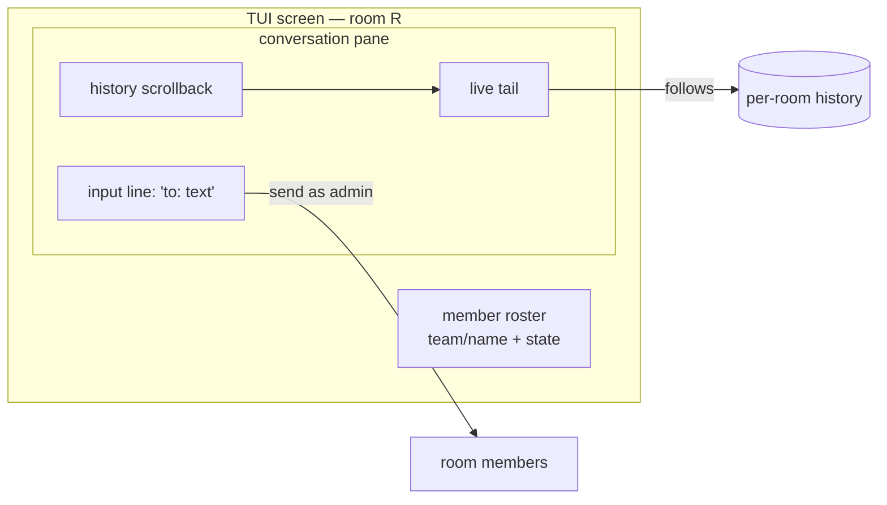

# Admin TUI — watch over the agents' conversation

Gate: not confirmed (automatic decisions, pending user review)

The admin is not a member. It never sits in a team, never owns an inbox,
and always names the room it operates on. Its job is oversight: watch
what the agents in a room are saying to each other as it happens, look
back at what was said earlier, and occasionally step in with a message.
The one-shot member verbs (`chat read` drains an inbox and exits) cannot
serve that role — oversight needs a live, persistent screen.

## Use cases

### UC1 — Watch a swarm working

- **Actor**: the human operator holding the admin age identity.
- **Situation**: a compose-launched swarm of agents is mid-task; the
  operator wants to see whether they are coordinating sensibly.
- **Intent**: observe the room's conversation live without joining it.
- **Walkthrough**: the operator runs
  `crabswarm chat admin tui --room R` (identity resolved the same way
  the other admin verbs resolve it). The screen opens directly on room
  R: a conversation pane fills with messages as members send them, and
  a roster sidebar lists every member with team, name, and harness
  state (`working` / `waiting` / `done`). The operator leaves it
  running in a pane; new messages append and the roster states update
  without any keypress.

### UC2 — Catch up on what already happened

- **Actor**: the same operator, arriving late.
- **Situation**: the swarm has been talking for an hour; the operator
  opens the TUI now.
- **Intent**: read the conversation that happened before the screen
  existed.
- **Walkthrough**: on startup the conversation pane is pre-filled from
  the room's message history (newest at the bottom, cursor following
  the tail). Scrolling up pages back through older history as far as
  retention keeps it. Scrolling back to the bottom re-attaches the
  live tail.

### UC3 — Step in

- **Actor**: the operator watching a room.
- **Situation**: an agent is stuck or two agents are talking past each
  other.
- **Intent**: inject a correcting message without leaving the screen.
- **Walkthrough**: the operator focuses the input line, types an
  address and text in the same `to: text` shape `chat send` uses
  (`backend/builder: stop, the schema changed`), and presses enter.
  The message is delivered as the admin (clearly labelled as such to
  recipients) and echoes into the conversation pane like any other
  message.

### UC4 — The failure experience

- Daemon not running → the TUI exits immediately with the same
  clear dial error the CLI verbs print, not a blank screen.
- Unknown room → exit with an error that lists the rooms that do
  exist (the admin can already enumerate them).
- Identity missing / challenge failed → the standard admin auth error,
  before any screen is drawn.
- Terminal too small → the roster collapses before the conversation
  pane does; the conversation is the part that must survive.

## Usability requirements

- **Invocation**: `crabswarm chat admin tui --room R`. `--room` is
  required — the admin always specifies the room explicitly (user
  requirement); there is no picker screen and no implicit default.
- **Zero-interaction watching**: after launch the screen is useful with
  no further input; watching is the default mode, sending is the
  exception.
- **Feedback**: the roster shows harness state so the operator can tell
  at a glance who is busy and who is idle; a status bar shows the
  room, connection health, and whether the view is tailing or
  scrolled back.
- **Familiar vocabulary**: the send input reuses the `to: text`
  addressing of `chat send`; no new address syntax to learn.
- **Exit**: `q` / `ctrl-c` leaves cleanly with the terminal restored.
