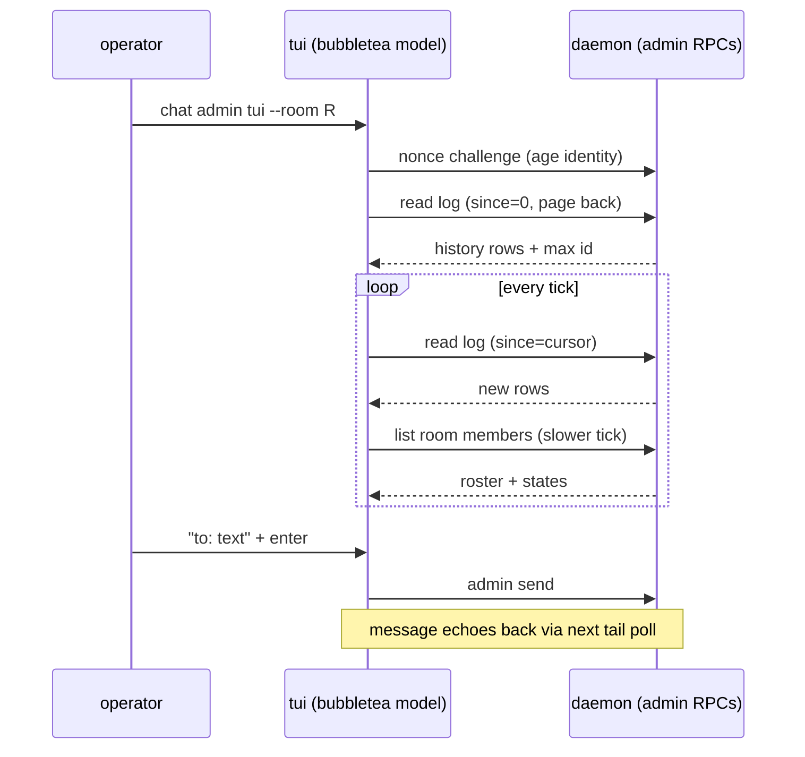

# Admin TUI

One-line: a bubbletea screen, `crabswarm chat admin tui --room R`, that
tails a room's conversation live, shows the member roster with harness
states, and lets the admin send into the room.

## Goal / success criteria

- The operator can watch a room's conversation update live without
  keypresses, scroll back through retained history, and send an
  admin-labelled message from the same screen (IDEA.md UC1–UC3).
- All failure paths in IDEA.md UC4 exit with a message, never a hung or
  corrupted terminal.

## Scope

- New TUI package and the `chat admin tui` verb wiring.
- Consuming — not defining — the admin auth plane, the admin send
  verb/RPC, and the per-room history read RPC (see boundary ledger).

## Non-goals

- No member-facing TUI; members keep the inbox CLI verbs.
- No web chat view (the unconsumed types under
  `web/src/gen/ngicks/crabswarm/chat/v1/` stay unconsumed here).
- No change to nudge/keystroke-injection behavior.
- No streaming RPC in v1 (D2 below; upgrade path noted in Risks).

## Context

- No TUI code exists under `crabswarm/chat/` or
  `cmd/crabswarm/commands/`; `cmd/crabswarm/commands/chat_read.go` is
  one-shot drain-and-exit.
- Repo design rules place terminal presentation outside `./cmd`, in a
  `cli/`-style package (`doc/rules`, ngicks.go.design-preference):
  `./cmd` parses flags and hands off.
- Admin verbs authenticate by age identity + nonce challenge
  (`crabswarm/chat/admin.go`, `crabswarm/chat/cli/admin.go`); the TUI
  reuses that client path unchanged.
- Member roster + states are already served to admins
  (`crabswarm/chat/admin_rooms.go` ListRooms/members;
  states mirrored per `crabswarm/chat/status.go`).
- Message history and admin send do not exist yet — they are owned by
  sibling plans drafted in parallel (see ledger); this plan builds the
  screen on their contracts.

## Approach

A single-screen bubbletea program in a new package
`crabswarm/chat/cli/tui`, launched by a thin
`cmd/crabswarm/commands/chat_admin_tui.go`. The model holds three
regions: conversation viewport, roster sidebar, input line + status
bar. Data arrives from two poll loops (`tea.Tick`-driven commands): a
history tail poll using a since-cursor against the room-log read RPC,
and a slower roster poll against the existing admin room listing.
Sending runs the admin send RPC and relies on the next tail poll to
echo the message back (single source of truth: the log).

Rejected alternatives:

- **Web SPA view instead of a TUI** — the operator lives in the
  terminal next to cmdman panes; a browser view is a separate later
  effort and doesn't replace an in-terminal watch screen.
- **Server-streaming RPC for the tail in v1** — plan
  `2026-08-31-02-chat_mcp_server` adds `ChatService.WatchRoom` backed
  by an in-daemon per-room fan-out; the TUI adopts it once that lands,
  but does not block on it — v1 tails by cursor poll (D2).
- **`chat read --follow` for admins** — a follow mode on the member
  read verb tails an inbox, not a room, and the admin has no inbox.



## Public surface delta

```
# CLI (added)
crabswarm chat admin tui --room R            # identity via the same flag/env the other admin verbs use
# --room is required; no default, no picker.

# Go (added)
package tui // crabswarm/chat/cli/tui

// Run draws the admin watch screen for one room and blocks until quit.
// deps carries the already-authenticated admin client facade.
func Run(ctx context.Context, deps Deps) error

type Deps struct {
    Room    string
    Log     LogReader    // per-room history read (owned by plan 05)
    Roster  RosterLister // existing admin room listing
    Sender  AdminSender  // admin send (owned by plan 01)
}
```

Interface shapes (`LogReader` etc.) are consumer-side minimal
interfaces defined in `tui`; their concrete implementations come from
`crabswarm/chat/cli` admin client code. Anything user-visible not in
the block above is out of scope.

## Boundary ledger

Every deliverable the admin-oversight feature needs end-to-end, with
its owner. Sibling plans are drafted in parallel; empty/foreign cells
must be reconciled when the family is reviewed together.

| Deliverable | Owning plan / step |
| --- | --- |
| Admin auth plane (age challenge client + interceptor) | exists (`crabswarm/chat/cli/admin.go`) |
| `chat admin` verb grouping | 2026-08-31-01-chat_admin_subcommand |
| Admin send verb + RPC (admin-labelled sender) | 2026-08-31-01-chat_admin_subcommand |
| Per-room history table + retention | 2026-08-31-05-per_room_message_history |
| Room-log read RPC (cursor/since paging) | 2026-08-31-01-chat_admin_subcommand (delivered: `ChatAdminService.History`, `since_id`) |
| Member roster + state listing | exists (`crabswarm/chat/admin_rooms.go`) |
| TUI screen (viewport/roster/input/status) | this plan, steps 2–4 |
| `chat admin tui` command wiring | this plan, step 5 |
| Presentation preview/mock | this plan, step 1 (planned artifact, not yet created) |

## Implementation steps

1. **Preview mock** — a `charm.land/bubbletea/v2` throwaway under this
   plan directory demonstrating the layout of IDEA.md's flowchart with
   fixture data, with a MOCK_LIMITS note (fakes: RPCs, states,
   timing). Deliberately not created in this drafting pass (D6).
   Delivered as [`mock/main.go`](./mock/main.go), disposable and kept
   out of the module build by the `tuimock` build tag; run it with
   `go run -tags tuimock ./doc/plan/2026-08-31-06-admin_tui/mock`. Its
   MOCK_LIMITS note is the file's header comment.
2. **`crabswarm/chat/cli/tui` model** — bubbletea model with
   conversation viewport, roster sidebar, input line, status bar;
   fixture-data unit tests for update logic (resize collapse order,
   scroll re-attach).
3. **Data loops** — tick commands: log tail poll with since-cursor
   (interval ~1s) against `LogReader`, roster poll (~5s) against
   `RosterLister`; startup back-page fill of the viewport.
4. **Send path** — parse the `to: text` input with the same address
   rules as `chat send` (reuse `crabswarm/chat/cli` parsing), call
   `AdminSender`, surface errors on the status bar.
5. **Command wiring** — `cmd/crabswarm/commands/chat_admin_tui.go`
   registers `tui` under the `chat admin` group from plan 01: flag
   parsing + admin dial only, then `tui.Run`.
6. **e2e smoke** — under `e2e/crabswarm`, drive the TUI headless
   (bubbletea's test program / `tea.WithInput`) against a live daemon:
   history fill, one live message appearing, one admin send.

## Testing and verification

- Unit: model update logic with fixture messages (step 2).
- e2e: step 6 covers UC1–UC3 end to end; UC4 error paths asserted as
  process exit + stderr, no screen.
- Manual: run against a compose-launched swarm; verify roster states
  track `report-state` transitions.

## Risks

- **Sibling contract drift** — plans 01/05 are drafted in parallel;
  the `LogReader`/`AdminSender` shapes here must be reconciled against
  their RPC definitions before implementation starts (tracked in the
  ledger).
- **Poll latency vs. feel** — 1s tail poll may feel laggy in a busy
  room; the upgrade path is a server-streaming RPC once the store
  gains a change signal, without changing the `tui` package's
  interfaces.
- **bubbletea v2 API churn** — pin the version at step 2; the ngplan
  skill's own Go-TUI guidance names `charm.land/bubbletea/v2`.

## Open questions

None — all resolved automatically per the user's directive; see
DECISION.md (entries tagged "automatic decision").
