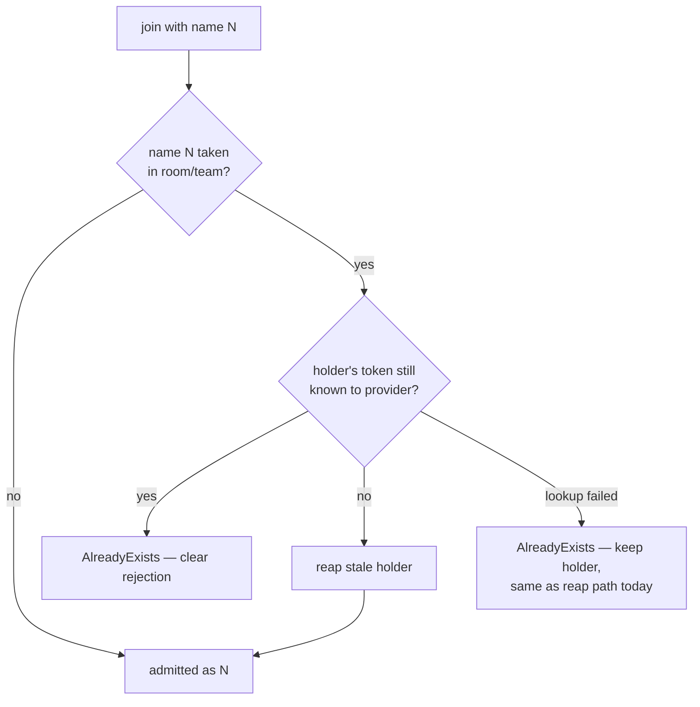

# Reclaim a gone member's name on duplicate-name join

Gate: confirmed by user, 2026-08-31 (with the reclaim extended to admin
MoveMember by the same answer round)

## How it should be

A member name belongs to whoever is actually there, not to a ghost. When a
joiner's name collides with an existing member, the server should first ask
"is that member still around?" — and when the previous holder is gone (its
token no longer resolves through the team-info provider), the name is freed
and the joiner is admitted under it. Only a collision with a *live* member
is a real configuration problem, and that keeps being rejected clearly at
join time.

This is what makes label-derived default names actually work with compose
lifecycles: a recreated replica comes back with a new identity token but
the same compose labels, so it derives the same name (`worker-1`) its dead
predecessor still holds. Today that join fails with `AlreadyExists` and
nothing ever frees the name — the stale member is reaped only when *it*
makes an RPC, which a removed command never will.

## Use case

- **Actor**: an operator running a compose project of harnesses; the
  harnesses auto-joining via hooks.
- **Situation**: `cmdman compose` recreates a replica (recreate,
  `down`+`up`, `scale` down/up) — remove-then-create, so the replica
  returns with a new `$CMDMAN_CMD_ID` but identical
  `cmdman.compose.command` / `cmdman.compose.scale-index` labels.
- **Intent**: the replica rejoins the room under its rightful name with no
  operator intervention.
- **Walkthrough**: the new session's hook calls `chat join` with no
  `--name`; the daemon derives `worker-1`, finds the name taken, checks the
  holder's token against the provider, finds it gone, drops the stale
  member (pending inbox included, as any reap does), and admits the joiner
  as `worker-1`. `chat members` shows exactly one `worker-1`. Nothing in
  the flow is visible to the operator except that it works.

## Usability requirements

- Fully automatic: no new flag, config, or admin verb is needed for the
  common recreate flow.
- A collision with a live member stays a clear `AlreadyExists` rejection —
  the inherited rule "duplicate participant name in a team → clear
  rejection at join time, not silent aliasing" is untouched; this only
  fixes *who counts as a participant*.
- The liveness check follows the existing reap semantics: a provider
  lookup that fails without a verdict keeps the holder (and rejects the
  joiner) rather than emptying names on a flaky cmdman.
- Applies to any joiner's name — label-derived or explicit `--name` — the
  same way; the joiner cannot tell how the name was chosen and neither
  should the collision rule.
- The same rule holds when an admin moves a member between teams: a name
  collision in the target team first checks whether the holder is still
  around, and a gone holder does not block the move. Only a live member
  blocks it.
