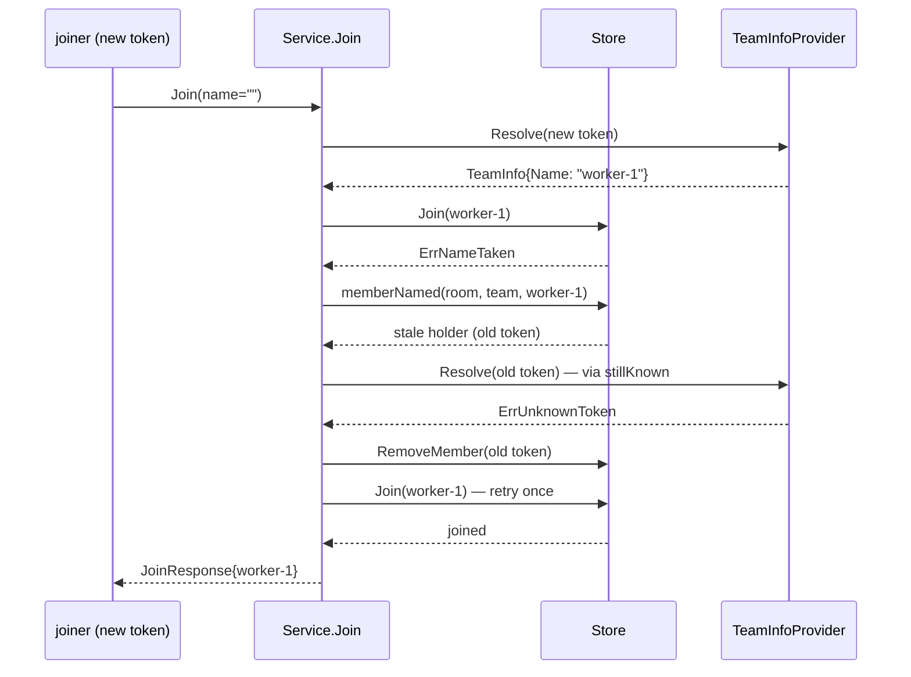

# Reclaim a gone member's name on duplicate-name join

On a name collision at join, verify the current holder's token through the
team-info provider and free the name when the holder is gone.

## Goal / success criteria

- A recreated compose replica (new token, same labels → same derived name)
  rejoins successfully; the stale predecessor is removed in the process.
- A collision with a live member — or with a holder whose provider lookup
  failed without a verdict — still returns `AlreadyExists`.
- Covered by a service unit test (derived name taken by a token the
  provider no longer knows) and an e2e recreate-shaped join test.

## Scope

- `crabswarm/chat` — `Service.Join` collision path plus whatever store
  lookup it needs; all within the one package.

## Non-goals

- No admin member-removal verb, no periodic sweep — reclaim happens at the
  moment it matters, on the colliding join. (Those may still be wanted
  someday; not here.)
- No change to `Store.MoveMember` collision semantics (an admin moving a
  member onto a stale name keeps being rejected; the admin plane can
  remove members when it grows that verb).
- No change to `defaultName`, label derivation, or explicit `--name`
  precedence.

## Context

- `crabswarm/chat/service_member.go:35-88` — `Service.Join`: fresh-join
  path calls `s.store.Join` at :76; `ErrNameTaken` surfaces via
  `storeStatus` as `AlreadyExists`.
- `crabswarm/chat/member.go:24-74` — `Store.Join`: inside one tx, token
  idempotency check, then `memberByName` collision check → `ErrNameTaken`,
  then insert.
- `crabswarm/chat/service.go:184-209` — `stillKnown(ctx, m)`: exactly the
  liveness-check-and-reap needed — agent-only, TTL-cached
  (`providerCheckTTL`, :76), keeps the member on a verdict-less lookup
  failure, removes from store + logs on `resolver.ErrUnknownToken`.
- `crabswarm/chat/member.go:301-307` — `memberByName` is unexported but
  `Service` lives in the same package.

## Approach

Handle the collision in `Service.Join` rather than inside `Store.Join`:
the store has no provider and must not grow one (placement knowledge stays
in the service; the store stays pure persistence).

In the fresh-join path, when `s.store.Join` fails with `ErrNameTaken`:

1. Look up the holder: a small store read by (room, team, name) — a new
   unexported method on `Store` wrapping `memberByName` with its own
   queries handle (e.g. `memberNamed(ctx, room, team, name)`).
2. Run `s.stillKnown(ctx, holder)`. It already does the right things:
   returns true for humans and recently-verified agents, keeps the member
   on verdict-less failures, reaps (RemoveMember + log) on
   `ErrUnknownToken`.
3. If `stillKnown` returned false (holder reaped), retry `s.store.Join`
   once. A second `ErrNameTaken` (someone else won the race) is returned
   as-is — clear rejection, no loop.
4. If the holder is alive, or the lookup between steps raced with the
   holder leaving (NotFound), return the original `ErrNameTaken` /
   retry once respectively — keep it simple: one retry total.

Rejected alternatives:

- Provider callback into `Store.Join` (inverts the store/service layering;
  the store would launch cmdman processes inside a DB transaction).
- Periodic sweep of all members (background machinery for a problem that
  only bites at join time; reap-on-collision is targeted and lazy like the
  existing reap).
- TTL-based staleness without asking the provider (guesses; the provider
  is the authority the reap path already trusts).

## Public surface delta

None. The reclaim is internal to package `crabswarm/chat` (`stillKnown`
and `memberByName` are unexported and in-package); no new exported symbol,
CLI flag, config key, RPC message, or schema change. The only visible
change is behavioral: a join that used to fail `AlreadyExists` against a
gone holder now succeeds.

## Implementation steps

1. **Store lookup.** Add unexported `Store.memberNamed(ctx, room, team,
   name)` (or reuse pattern of `Store.Resolve`) in
   `crabswarm/chat/member.go` returning `memberByName(ctx, s.q, ...)`.
   Verify: trivially via step 2's tests.
2. **Service reclaim path.** In `Service.Join`
   (`crabswarm/chat/service_member.go:76-85`), on `ErrNameTaken`: look up
   the holder, `stillKnown`, retry once as per Approach. Extract the
   join-attempt into a small helper if the flow reads better. Update
   `Join`'s doc comment (name collision now checks the holder's
   liveness). Verify: service tests in
   `crabswarm/chat/service_member_test.go` — (a) derived name held by a
   token the provider no longer knows → join succeeds, stale member gone;
   (b) held by a live agent → `AlreadyExists`; (c) held by a human →
   `AlreadyExists`; (d) provider lookup fails without verdict →
   `AlreadyExists`, holder kept.
3. **e2e.** In `e2e/crabswarm/chat_test.go`, recreate-shaped flow: join as
   derived `worker-1`, drop the old token from the stub roster, join with
   a new token carrying the same labels, assert the new member is
   `worker-1` and the member list holds exactly one.

## Testing / verification

- `go test ./crabswarm/chat/... ./e2e/...`.
- Manual: `cmdman compose` a replica, hook-join, recreate the replica,
  confirm rejoin under the same name.

## Risks

- Reaping discards the stale member's pending inbox (existing reap
  semantics, `Store.RemoveMember` cascades messages). Acceptable: the
  addressee process is gone; a successor is a different session.
- `providerCheckTTL` (30s) could vouch for a just-removed holder if it
  made an RPC within the window; the joiner then gets `AlreadyExists`
  once and succeeds on the next hook retry. Cosmetic, self-healing.

## Open questions

1. Should the reclaim also cover `Store.MoveMember` / admin-path name
   collisions, or stay join-only? Tentative default: join-only (see
   Non-goals); the admin plane grows explicit removal instead.
