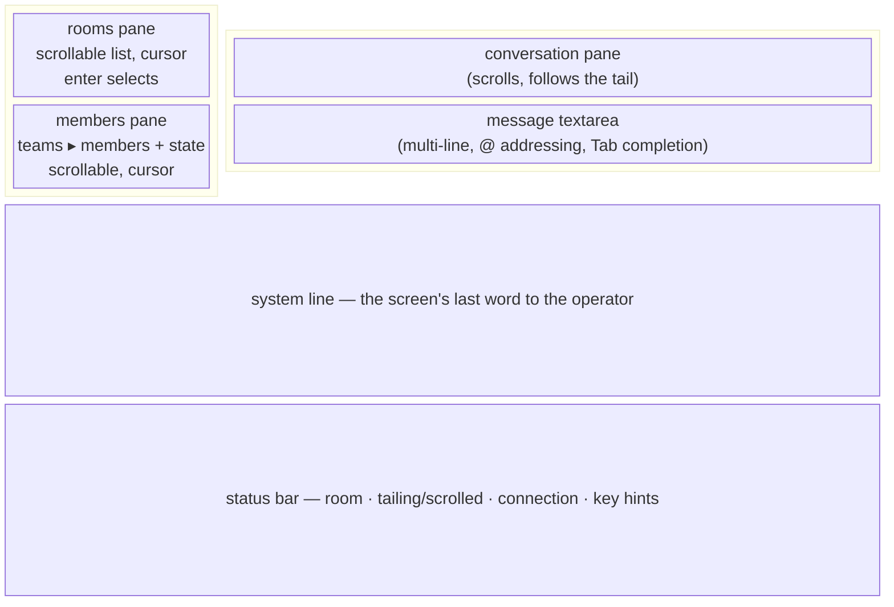
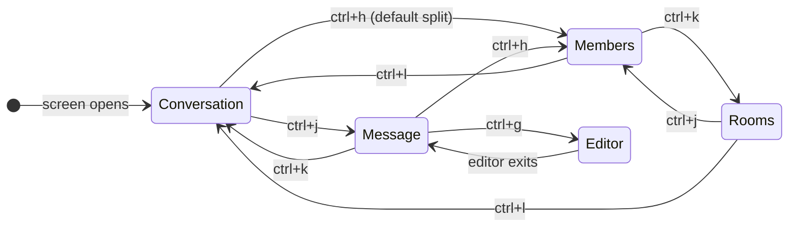
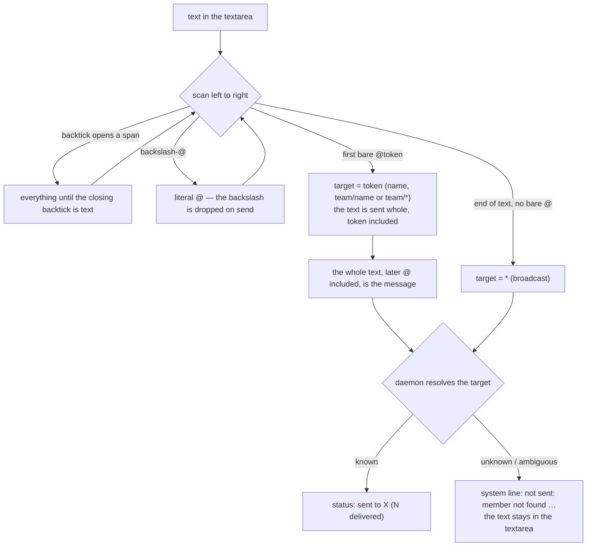
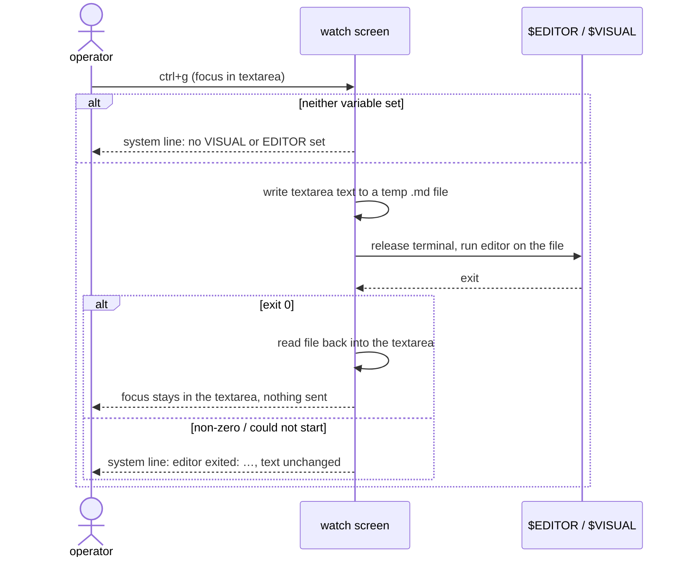

# Admin TUI — panes you can read, a textarea you can write in, `@` addressing

Gate: confirmed by user, 2026-09-02

The watch screen shipped by `doc/plan/2026-08-31-06-admin_tui` works but is
hard to read: three regions with no visible edges, a single-line input, and
a `to: text` addressing form that has to be typed from memory. This plan
restates the whole screen as it should be — not a delta — because the
previous IDEA.md was never gate-confirmed. What stays from it is cited; what
changes is spelled out.

The operator is still the human holding the admin age identity and still
not a member. Which room the screen shows is chosen on the screen
itself, from a room list; `--room` is kept but optional, and when given
it is the room selected when the screen opens (D14). Watching the room with no keypress
stays the default mode (prior UC1/UC2).

## The screen

Two columns. The left column spans the full height and holds two
scrollable lists: rooms above, members below. The right column holds the
conversation above the message textarea. The system line and the status
bar run under both. Every pane has a visible frame and a title, laid out
by a constraint solver so they never overlap or run off the terminal:

```
┌ rooms (4) ───────┐┌ conversation ─────────────────────────────┐
│ ▸ /work          ││ 12:00:01 alpha/ana → *: rebasing onto main │
│   /src/cmdman    ││ 12:00:07 alpha/bob → *: the branch is green│
│   /src/crabswarm ││ 12:00:09 admin/admin → alpha/ana: hold it  │
│   /home/op/.dotf…││                                            │
└──────────────────┘│                                            │
┌ members (3) ─────┐│                                            │
│ alpha            ││                                            │
│  ▸ ana   working ││                                            │
│    bob   waiting │└────────────────────────────────────────────┘
│ beta             │┌ message ──────────────────────────────────┐
│    cy    done    ││ @alpha/ana hold the deploy until the      │
│                  ││ schema lands                              │
└──────────────────┘└────────────────────────────────────────────┘
 no VISUAL or EDITOR set                                 ← system line
 room /work · tailing · connected · ^hjkl panes · ^g editor · q quits
```



Exactly one pane holds focus at a time; the focused pane's frame is drawn
brighter. Focus moves with `ctrl+h` / `ctrl+j` / `ctrl+k` / `ctrl+l` in the
spatial direction (left / down / up / right), from any pane, the textarea
included. The old modal `i` / `esc` scheme is gone: there is no "watch
mode", only "which pane is focused".



The two columns do not share row boundaries, so a horizontal move has to
pick one of two panes on the other side. Nothing is hard-wired: the
target is read off the solved layout (D15) — the pane adjacent in that
direction whose rows overlap the focused pane's the most. The diagram
above shows what that yields for the default proportions — note that the
tall conversation pane shares more rows with members than with the short
rooms pane, so `ctrl+h` from the log lands on members, and rooms is
reached with one more `ctrl+k`; on a short terminal where the log is
only a few rows tall the same key lands on rooms. A different split, or
a resized terminal, moves the boundaries and the keys follow.

## Use cases

### UC1 — Watch a swarm working (unchanged from the prior plan)

The operator runs `crabswarm chat admin tui` (or `--room R` to open on
that room) and reads. New
messages append; roster states update; nothing needs a keypress; a line
that mentions `@admin` is pink, so the operator sees when the room is
talking to them. The
difference now is legibility: the operator can tell at a glance where the
conversation ends and the member list begins, which room they are looking
at, and which pane a keypress would go to.

### UC1b — Switch to another room

- **Actor**: the operator, several swarms running in several rooms.
- **Intent**: look at a different room without leaving the screen.
- **Walkthrough**: `ctrl+h` from the conversation lands on the rooms
  pane. `j`/`k` move the cursor over every room the daemon knows (the
  same list `chat admin list` prints); `enter` selects one. The
  conversation reloads with that room's log and re-attaches to its tail,
  the members pane shows that room's roster, and the status bar's room
  segment changes. Each room keeps its own draft: the textarea shows
  what was typed for the newly selected room, and switching back restores
  the earlier text (D16). A room that has appeared or
  disappeared since the screen opened shows up in the list on its next
  refresh.

### UC2 — Catch up on what already happened

`ctrl+k` moves focus up from the textarea; the pane above it is the log.
There, vim keys move: `j`/`k` one line, `ctrl+d`/`ctrl+u` half a page, `gg` to the top,
`G` to the bottom (`h`/`l` do nothing — the log soft-wraps). Scrolling up
holds the view still while the room talks on; reaching the bottom
re-attaches the live tail. The status bar says which.

### UC3 — Address one member without typing its name

- **Actor**: the operator, looking at the members pane.
- **Situation**: an agent named `ana` in team `alpha` is stuck.
- **Intent**: send `ana` a message, and be sure it went to *that* `ana`
  (names collide across teams; only `team/name` is unambiguous).
- **Walkthrough**: `ctrl+h` from the textarea moves focus to the members
  pane. `j` / `k` move a cursor over teams and members alike. `enter` on a member puts
  `@alpha/ana ` at the start of the message textarea and moves focus
  there. The operator types the text and sends. The status bar says
  `sent to alpha/ana (1 delivered)`.

### UC3b — Address a whole team

- **Actor**: the operator, looking at the members pane.
- **Situation**: team `beta` is about to step on team `alpha`'s branch.
- **Intent**: tell everyone in `beta`, and nobody else.
- **Walkthrough**: cursor onto the `beta` heading, `enter`. The textarea
  gets `@beta/* ` and focus. Sending delivers to every current member of
  `beta`; the status bar says `sent to beta/* (2 delivered)`. Typing
  `@beta/*` by hand does the same, and the `@` dropdown offers each team's
  `team/*` row above its members.

### UC4 — Address by typing, with completion

- **Actor**: the operator, focus already in the textarea.
- **Situation**: they know the name, or the start of it.
- **Intent**: type the address rather than reach for the roster.
- **Walkthrough**: they type `@an` and press `Tab`. A dropdown opens just
  above the textarea listing every roster member whose `team/name` or
  `name` starts with `an`, one per line, `team/name  state`. `Tab` (or
  `j`/`k`, down/up) moves through the list; `enter` or a second `Tab`
  accepts and replaces `@an` with `@alpha/ana `; `esc` closes the list
  and leaves the text as typed. With exactly one match, the first `Tab`
  completes immediately, no list.

### UC5 — Say something to everyone

The operator types text with no `@` in it and sends. It goes to the whole
room, the way `*` did. No addressing syntax has to be learned to
broadcast; addressing is the exception, broadcasting is the default.

### UC6 — Mention a member without addressing it, and write a literal `@`

- `@alpha/ana ask @alpha/bob for the token` — the first `@` is the
  target, so this goes to `ana`. The text is sent whole, `@alpha/ana`
  included: the target token doubles as a mention, and `@alpha/bob`
  stays in the text as a second one `ana` can read.
- `` ask `@here` who owns it `` — an `@` inside backticks is text, not an
  address, so this broadcasts with the backticks kept (agents read
  markdown code spans as literal).
- `send it to ops\@corp.example` — `\@` is a literal `@`; the backslash
  is removed on send. This also broadcasts.



### UC7 — Write a long message in a real editor

- **Actor**: the operator, focus in the textarea, half a message typed.
- **Intent**: finish it in their editor of choice, with its keybindings.
- **Walkthrough**: `ctrl+g`. The screen releases the terminal, the editor
  named by `$VISUAL` — or, if that is unset, `$EDITOR` — opens on a
  temporary markdown file already holding the textarea's contents. The
  operator edits, saves, quits. The screen comes back with the file's
  contents as the textarea's text, cursor at the end, nothing sent yet.
  They review and send with the send key.
- **Failure**: neither variable set → nothing happens on screen except the
  system line saying `no VISUAL or EDITOR set`. The editor exits non-zero
  → the textarea is left as it was and the system line says
  `editor exited: <error>`. The editor could not be started → the same,
  with the exec error.



### UC8 — Send, and see how it went

`ctrl+enter` sends; `enter` inserts a newline, always. Sending parses the
textarea, clears it, and delivers. The message
appears in the conversation pane when the log brings it back (no local
echo — prior plan's rule, unchanged). Failure puts the text back into an
empty textarea and reports on the system line, exactly as today.

### UC9 — The failure experience before the screen opens (unchanged)

Daemon down, unknown room, missing identity: refused with a plain error
before the terminal is taken over (prior UC4).

## Usability requirements

- **Legibility first**: every pane has a border and a title; the focused
  one is visibly different. Region sizes come from a constraint layout,
  not hand arithmetic, so resizing the terminal never produces overlap or
  a pane pushed off-screen.
- **Spatial navigation**: `ctrl+{h,j,k,l}` moves focus in the direction
  named, from every pane. No pane swallows those keys.
- **Typing is never ambiguous**: keys reach the textarea only while it
  holds focus. In the other panes, letters are vim navigation (`j`/`k`,
  `gg`/`G`, `ctrl+d`/`ctrl+u`; `q` quits). `ctrl+c` quits from anywhere.
- **Send key fallback**: the screen asks the terminal for the kitty
  keyboard protocol / xterm modifyOtherKeys so `ctrl+enter` is reportable.
  Where the terminal supports neither, `ctrl+x` is the send key and
  the status hint says so; `ctrl+x` sends everywhere regardless
  (`alt+enter` is out: wezterm takes it for toggle-fullscreen).
- **Addressing**: `@` is the only addressing syntax on this screen; the
  `to: text` form is gone. No `@` means broadcast to the room. The first
  bare `@token` is the target — a member as `name` or `team/name`, or a
  whole team as `team/*` — and the text is sent whole, token included.
  `\@` and backtick spans protect a literal `@`. Completion always
  inserts the unambiguous `@team/name` or `@team/*`.
- **Send key**: `ctrl+enter` sends, `enter` is a newline. Never
  enter-to-send.
- **Defaults match the common case**: broadcasting needs no syntax; the
  roster-selected target is pre-filled, not remembered as hidden state.
- **Feedback**: the status bar keeps room / tailing / connection / key
  hints; anything the screen has to *tell* the operator (send result,
  editor problems, parse errors) goes on the system line under the
  textarea, where the eyes already are while typing.
- **Editor**: `ctrl+g`, `$VISUAL` then `$EDITOR`, temp file is markdown.
  The command may carry arguments (`code -w`).
- **Narrow terminals**: below the width gate the screen shows one column
  at a time — the conversation and textarea by default; a focus move
  toward the left column (`ctrl+h`) swaps it on screen, and `ctrl+l`
  swaps back (D18). Nothing is lost, only hidden. The textarea shrinks
  before the conversation does; the system line and status bar are never
  dropped. Short terminals shrink
  the rooms pane before the members pane; each list scrolls rather than
  truncates.
- **Discoverability**: the status bar's hint names the three keys that
  cannot be guessed from the screen: pane movement, the editor, and quit.
- **Room list**: shows every room the daemon knows, the current one
  marked; long paths are truncated from the left so the distinguishing
  tail stays visible. The list scrolls.
- **Look**: the bubbletea example palette — purple for the focused frame
  and titles, pink for cursors and selections, dim gray for the status
  and system lines. One scheme, ANSI-256, readable on dark and light
  terminals; no truecolor dependency.
- **Mentions of the admin stand out**: an entry whose text carries a bare
  `@admin` or `@admin/admin` — outside backticks, not `\@`-escaped, the
  same tokenizer as sending — is drawn in the mention color (pink), the
  token itself bold. The admin has no member row, so a member cannot
  *address* it; a mention in the text is how an agent talks back, and
  the operator must not miss it while scrolling a busy room.
