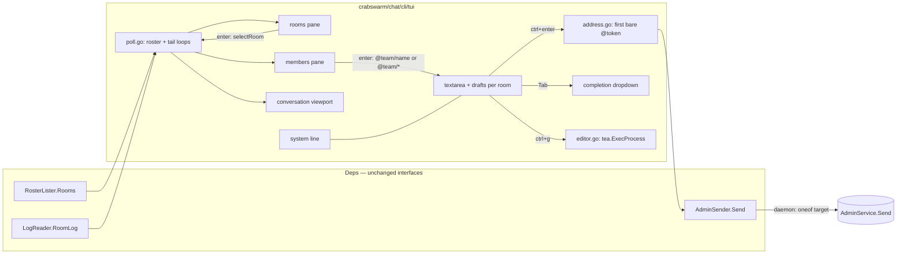

# Admin TUI — panes, textarea, `@` addressing, editor hand-off

Rework `crabswarm chat admin tui` into framed, focus-navigable panes with a
multi-line textarea, `@`-based addressing with Tab completion, and a
`ctrl+g` hand-off to `$VISUAL`/`$EDITOR`, plus a rooms pane that switches
the room on screen.

> PLAN.md is a skeleton until IDEA.md's gate is confirmed. Contracts,
> surface delta and implementation steps are filled in after that.

## Goal / success criteria

Derived from IDEA.md:

1. The screen has two columns of framed, titled panes — rooms over
   members on the left, full height; conversation over the message
   textarea on the right — plus the system line and status bar under
   both, sized by `github.com/charmbracelet/ultraviolet/layout`; no
   region overlaps or overflows at any terminal size ≥ the documented
   minimum. Selecting a room in the rooms pane switches the conversation
   and members panes to that room.
2. `ctrl+h/j/k/l` moves focus between panes from every pane; the focused
   frame is visibly distinct; the old `i`/`esc` mode switch is gone.
3. The message input is `charm.land/bubbles/v2/textarea`, multi-line.
4. A typed message is addressed by the first bare `@token` (`name`,
   `team/name`, or `team/*` for a whole team), sent whole; `\@` and
   backtick spans are escapes; no `@` broadcasts; `Tab` completes
   `@prefix` from the roster via a dropdown; the roster's `enter`
   pre-fills `@team/name ` or `@team/* `. `ctrl+enter` sends, `enter`
   inserts a newline.
5. `ctrl+g` edits the textarea contents in `$VISUAL` (else `$EDITOR`); the
   absence of both is reported as `no VISUAL or EDITOR set` on the system
   line.
6. The e2e suite covers UC3–UC8 the way `e2e/crabswarm/chat_tui_test.go`
   covers today's UC1–UC3.

## Scope

- `crabswarm/chat/cli/tui/` — model, layout, key routing, the `@` parser
  (or its home in `crabswarm/chat/cli/`), completion dropdown, editor
  hand-off, system line.
- `cmd/crabswarm/commands/chat_admin_tui.go` — the `Long` help text names
  the keys and the addressing form; it must say what the screen now does.
- `e2e/crabswarm/chat_tui_test.go` — currently types `i` then
  `alpha/ana: hold the deploy\r`; breaks on day one of this plan.
- `go.mod` — `github.com/charmbracelet/ultraviolet` moves from indirect
  to direct (same pseudo-version bubbletea pins).
- `api/schema/proto/ngicks/crabswarm/chat/v1/chat_service.proto`,
  `crabswarm/chat/admin_rooms.go`, `delivery.go`, `inbox.go`, a new sqlc
  query — `AdminSendRequest.target` becomes a `oneof` with a team case
  (D10, D20); `crabswarm/chat/cli/admin.go` and
  `cmd/crabswarm/commands/chat_admin_send.go` map argv onto it.
- `cmd/crabswarm/commands/chat_admin_tui.go` — `--room` becomes optional
  (D14).

## Non-goals

- No daemon or proto change beyond the one team-wide send target
  (`AdminService.Send` gains a team form; see the surface delta).
- No streaming replacement for the tail poll (backlog item "WatchRoom
  upgrade path").
- No room *creation* or removal from the screen; the rooms pane lists
  what the daemon already knows (D13 retired prior D3's "no room
  picker"; `--room` stays, optional — D14).
- No change to `crabswarm chat send` / `chat admin send` argv addressing.

## Known context (verified 2026-09-02)

- `crabswarm/chat/cli/tui/model.go` — `model` holds `viewport.Model` +
  `textinput.Model`, hand-computed sizes (`rosterWidth = 22`,
  `chromeHeight = 2`, `rosterMinWidth = 60`), a `notice` string shown in
  the status bar, and a two-mode key router (`watchKey` / `composeKey`).
- `crabswarm/chat/cli/tui/send.go` — `submit` parses with
  `cli.ParseAddressedLine` (its only non-test caller), clears the input,
  and `applySent` puts the line back on failure.
- `crabswarm/chat/cli/tui/poll.go` — two poll loops; untouched by this
  plan except `applyTail` calling `layout()`.
- `crabswarm/chat/admin_rooms.go` — `AdminService.Send` target is `*`
  (`adminEveryone`) or a member address; `crabswarm/chat/member.go:258`
  resolves `team/name` exactly or a bare `name` when unique. **There is no
  team-wide target.**
- `validateName` (`crabswarm/chat/store.go:235`) forbids only `/`, empty,
  and the reserved `admin`; a name *may* contain spaces or `@`.
- `charm.land/bubbles/v2/textarea` default `KeyMap` binds `ctrl+h`
  (delete back), `ctrl+k` (delete after cursor), `ctrl+g` (select all),
  `enter` (newline). All four collide with this plan's keys and must be
  intercepted before `textarea.Update` / unbound.
- Key decoding (`ultraviolet/decoder.go` `parseControl`): byte `0x08` →
  `ctrl+h`, `0x7F` → `backspace`, `0x0A` → `ctrl+j`. Terminals that send
  `0x08` for Backspace cannot distinguish it from `ctrl+h` without the
  kitty keyboard protocol (`tea.View.KeyboardEnhancements`).
- `charm.land/bubbletea/v2@v2.0.9` `View.Content` is a string; overlays
  (the dropdown) compose through `charm.land/lipgloss/v2` `Layer` /
  `Compositor` (`layer.go`) or `Canvas` (`canvas.go`), which render to a
  string. `layout.Split` only returns `uv.Rectangle` (= `image.Rectangle`).
- `tea.ExecProcess` (`bubbletea/v2/exec.go`) releases the terminal, runs
  an `*exec.Cmd` with the program's input/output, and resumes with a
  callback message. `github.com/mattn/go-shellwords` is already a
  dependency for splitting `$EDITOR`.
- e2e drives the screen in-process through `tea.WithInput`/`WithOutput`
  pipes and scrapes ANSI; an editor test must use a scripted `EDITOR`
  that writes the file and exits.

## Approach

The screen keeps its shape as one bubbletea model in `crabswarm/chat/cli/tui`
behind the same `Deps` interfaces; what changes is inside. Rectangles come
from `ultraviolet/layout` (D5): the terminal is split into the two bottom
lines and the body, the body into a fixed-width left column and the rest,
the left column into rooms over members, the right into conversation over
the textarea. Every keypress goes through one router: `ctrl+c` quits from
anywhere; `ctrl+h/j/k/l` are resolved geometrically against the solved
rectangles (D15) and never reach a pane; everything else goes to the
focused pane — vim navigation in the three lists, the textarea otherwise.
Below the width gate the body holds one column and a horizontal move swaps
which (D18).



The daemon side is small and separate: `AdminSendRequest.target` becomes
a `oneof` (D10, D20); the store gains a team-scoped broadcast next to
`broadcastAs`; `admin_rooms.go` switches on the case. The CLI's
`chat admin send` keeps its argv grammar and translates.

**Rejected**: a separate rooms screen before the watch screen (the user
wants both on one screen); keeping the modal `i`/`esc` router beside the
panes; a string `team/*` target (D10).

Preview: `mock/main.go` (build tag `tuimock`) was run from `main/` with
`go run -tags tuimock ./doc/plan/2026-09-02-01-admin_tui_panes_mentions/mock`.
It demonstrated D1–D3, D9, D12–D18 with a fixture roster; its
`# MOCK_LIMITS` header listed what it faked, and `MOCK_LIMITS.md` mapped
each item onto the use cases and decisions it could not validate. It was
disposable: the directory and that file were deleted once the screen
landed in step 6.

## Public surface delta

Authority is the fenced code below; anything user-visible or durable not
in it is out of scope until amended.

### Dependency delta

```diff
--- go.mod
 require (
+	github.com/charmbracelet/ultraviolet v0.0.0-20260811164956-006e29f97886
 )
 require (
-	github.com/charmbracelet/ultraviolet v0.0.0-20260811164956-006e29f97886 // indirect
 )
```

Justified in D5. No other dependency changes; `charm.land/bubbles/v2`
(textarea, viewport), `charm.land/lipgloss/v2` (frames, compositor) and
`github.com/mattn/go-shellwords` (editor argv) are already direct.

### RPC schema delta

`api/schema/proto/ngicks/crabswarm/chat/v1/chat_service.proto`:

```proto
message AdminSendRequest {
  // Room is the room to deliver into.
  string room = 1;
  // Text is the message body.
  string text = 3;
  // Target says who in Room receives the message. Exactly one case is set.
  oneof target {
    // Everyone addresses every member of Room.
    Everyone everyone = 4;
    // Team addresses every member of one team of Room.
    TeamTarget team = 5;
    // Member addresses one member of Room.
    MemberTarget member = 6;
  }
  reserved 2; // the former string target
}

// Everyone is the whole-room target; it carries nothing.
message Everyone {}

// TeamTarget is every current member of Team, counted at send time.
message TeamTarget {
  string team = 1;
}

// MemberTarget is one member. An empty Team resolves Name the way a bare
// name does for a member send: in the sender's team first — the admin has
// none — then uniquely across the room; a name carried by two teams is
// rejected as ambiguous and the error names them.
message MemberTarget {
  string team = 1;
  string name = 2;
}
```

`AdminSendResponse`, `ListRooms`, `AdminHistory` and the member-plane
messages are unchanged. Field 2 (the old `string target`) is reserved
rather than reused.

### Exported Go surface

```go
// crabswarm/chat/cli/admin.go — the target is typed now, not a string.

// AdminTarget is who an admin send is for: exactly one of the three.
type AdminTarget struct {
	Everyone bool
	Team     string // TeamTarget when set and Name is empty
	Name     string // MemberTarget with Team (may be empty) when set
}

// ParseAdminTarget maps the `chat admin send` argv grammar onto AdminTarget:
// "*" → Everyone; "team/*" → Team; "team/name" → Team+Name; "name" → Name.
func ParseAdminTarget(s string) (AdminTarget, error)

func (a *AdminClient) Send(ctx context.Context, room string, target AdminTarget, text string) (delivered int32, err error)
func (c *Client) AdminSend(ctx context.Context, w io.Writer, identityPath, room string, target AdminTarget, text string) error

// crabswarm/chat/cli/args.go — removed: ParseAddressedLine (only caller was the TUI).

// crabswarm/chat/cli/tui/tui.go
type AdminSender interface {
	Send(ctx context.Context, room string, target cli.AdminTarget, text string) (delivered int32, err error)
}

type Deps struct {
	// Room is the room selected when the screen opens. Empty selects the
	// first room the daemon lists; a non-empty room the daemon does not know
	// is refused before the terminal is taken over.
	Room   string
	Log    LogReader
	Roster RosterLister
	Sender AdminSender
	// Editor is the command run by ctrl+g, already resolved by the caller
	// (cli.EditorFromEnv); empty means "no VISUAL or EDITOR set".
	Editor string
}

// crabswarm/chat/cli/editor.go — the one place $VISUAL / $EDITOR are read
// (crabswarm/config.go's rule: no os.Getenv under ./cmd).

// EditorFromEnv returns $VISUAL, else $EDITOR, else "".
func EditorFromEnv() string
```

Unexported inside `tui`, named here so steps can cite them: `address.go`
(`parseAddress(text string) (target cli.AdminTarget, ok bool)`, the
first-bare-`@token` grammar with backtick spans and `\@`, plus
`mentionsAdmin(text string) bool` on the same tokenizer), `layout.go`
(`rects`, `moveFocus`), `styles.go` (the D21 palette), `rooms.go`,
`members.go`, `completion.go`, `editor.go`, `drafts` map on the model.

### CLI delta

```sh
# --room is optional; without it the screen opens on the first listed room.
crabswarm chat admin tui
crabswarm chat admin tui --room /work/proj
crabswarm chat admin tui --room /work/proj --identity ~/.config/crabswarm/chat_admin.key

# unchanged spelling, new team form; each maps onto the oneof:
crabswarm chat admin send /work/proj '*'         'stand by'     # Everyone
crabswarm chat admin send /work/proj 'alpha/*'   'rebase now'   # TeamTarget{alpha}
crabswarm chat admin send /work/proj 'alpha/ana' 'hold it'      # MemberTarget{alpha, ana}
crabswarm chat admin send /work/proj 'ana'       'hold it'      # MemberTarget{"", ana}
# a member literally named "*" is reachable from argv or a typed @ only as
# the team case; the members pane's enter is the one path that addresses it.
```

Keys on the screen (documented in the command's `Long`): `ctrl+h/j/k/l`
panes, `j/k gg G ctrl+d ctrl+u` in lists, `enter` selects (rooms) or
pre-fills (members), `ctrl+enter` / `ctrl+x` sends, `enter` newline,
`Tab` completes `@`, `ctrl+g` editor, `q` (lists) / `ctrl+c` quits.

Environment read (by `cli.EditorFromEnv`, not `./cmd`): `VISUAL`, then
`EDITOR` (D8).

### Persistent data delta

No change: no schema or file format is touched. The new sqlc query
`ListTeamMembers` reads the existing `members` table.

```sql
-- crabswarm/chat/internal/schema/queries/queries.sql
-- name: ListTeamMembers :many
SELECT token, name, team, room, kind, state, state_reported_at FROM members
WHERE room = ? AND team = ? ORDER BY name;
```

## Implementation steps

Each step builds, vets and passes `go test ./crabswarm/... ./cmd/...` on
its own; `./e2e/...` passes again from step 3 on (which repairs the
script it breaks) and gains its new cases in step 7.

1. **Proto and daemon: `oneof target`** (D10, D20).
   `chat_service.proto` as in the delta; `go generate ./api/...`.
   `queries.sql` gains `ListTeamMembers`; `go generate
   ./crabswarm/chat/internal/schema/` (`go tool sqlc generate`). `inbox.go`:
   `broadcastTeamFrom`/`broadcastTeamAs` beside `broadcastFrom`/
   `broadcastAs`, `ErrNotFound` when the team is empty; `delivery.go`:
   `broadcastTeamAs` notifying each recipient. `admin_rooms.go`: `Send`
   validates that exactly one case is set (`InvalidArgument` otherwise)
   and `deliverAdminMessage` switches on it; `MemberTarget` with empty
   team goes through `resolveFor` with a bare name, with team through
   the qualified path (build the `team/name` string at that one call
   site, or add a `resolveMember(q, caller, team, name)` — implementer's
   choice). Delete `adminEveryone`. Tests: `admin_rooms_test.go` cases
   for each case, the empty-team `NotFound`, the no-case
   `InvalidArgument`, the ambiguous bare name.
   Verify: `go test ./crabswarm/chat/...`.

2. **CLI mapping** (D10, D20). `cli/admin.go`: `AdminTarget`,
   `ParseAdminTarget`, `Send`/`AdminSend` typed; `RenderAdminSent` prints
   the target as typed. `chat_admin_send.go` `Use` and `Long` name the
   `team/*` form. Remove `ParseAddressedLine` and its tests
   (`cli/args.go`, `cli/args_test.go`). Update
   `TestChat_AdminSendsWithoutAttending` in `e2e/crabswarm/chat_test.go`
   and add a `team/*` case to it.
   Verify: `go test ./crabswarm/chat/cli/... ./e2e/...`.

3. **Layout and focus** (D5, D13, D15, D18). `go.mod` promotion. New
   `tui/layout.go`: `rects(width, height, textRows)` with the split from
   the mock (`leftWidth = 22`, `leftMinWidth = 60`, rooms
   `Len(min(rooms+2, max(h/3, 3)))`, members `Fill(1)`, right
   `Fill(1)`/`Len(textRows+2)`, then system line and status bar); the
   narrow branch returns one column and a `showLeft` flag. `moveFocus`
   ported from the mock (`beyond`/`shares`, largest overlap, tie upper/
   left, no wrap); below the gate a move toward the hidden column flips
   `showLeft`. Frames drawn by `paneLayer` with the title and the focus
   style, composed with `lipgloss.Compositor`; every color comes from
   `styles.go` (D21), nothing inline. `model.go` loses
   `rosterWidth`, `chromeHeight`, `rosterMinWidth`, `rosterShown`,
   `watchKey`/`composeKey`; the router becomes `key` → global keys →
   focused pane. The conversation pane owns
   UC2/D12 here: `j`/`k`, `gg`/`G`, `ctrl+d`/`ctrl+u` on the viewport,
   `following` cleared on scroll-up and set again at the bottom. Repair
   `e2e/crabswarm/chat_tui_test.go` minimally: the `i` + `…\r` script
   becomes `ctrl+j` into the textarea, the text, `ctrl+x`. Unit
   tests: table over sizes asserting no overlap and full coverage of the
   terminal; `moveFocus` at 80×24 (conversation `ctrl+h` → members),
   60×10 (→ rooms), 59×24 (swap).
   Verify: `go test ./crabswarm/chat/cli/tui/ ./e2e/...`.

4. **Rooms and members panes** (D1, D14, D19). `rooms.go`: list from the
   roster poll's `[]*chatv1.Room`, cursor, scroll window, `enter` →
   `selectRoom`: stash draft, load draft (D16), `cursor = 0`, entries
   cleared, `following = true`, status-bar room updated. `members.go`:
   today's `rosterPane` with the cursor over headings and members;
   `enter` pre-fills `@team/name ` / `@team/* ` and focuses the textarea
   (D1). `tui.go`: `openRoom` accepts an empty `Deps.Room` and picks the
   first listed room; with no rooms at all it opens onto an empty screen
   whose rooms pane fills on the next poll (UC1b says rooms appear
   later), while a *named* unknown room is still refused before the
   terminal is taken over.
   `chat_admin_tui.go`: `--room` optional, `Use: "tui [--room <room>]"`,
   remove `MarkFlagRequired`. Tests: `model_test.go` select/switch,
   draft round-trip, pre-fill text.

5. **Textarea, `@` parser, completion, send** (D2, D3, D6, D7, D11, D17).
   `charm.land/bubbles/v2/textarea` replaces `textinput`; unbind
   `ctrl+h/k/g` and `enter`-to-send in its `KeyMap`; `DynamicHeight`
   with `MaxHeight = 6` feeding `rects`. `address.go` + table test (UC6's cases), including
   `mentionsAdmin` (D22: `@admin`, `@admin/admin`, backticked and
   escaped negatives); `conversation()` renders a mentioning entry in
   the mention style with the token bold. `completion.go`: `Tab` on a `@prefix` opens the list
   from the current roster (`team/*` rows above members), `Tab`/`j`/`k`
   move, `enter`/second `Tab` accept, `esc` closes; single match
   completes in place. `send.go`: `submit` parses, clears, sends the
   `AdminTarget`; failure restores the text and writes the system line
   (D4). `View()` requests `KeyboardEnhancements{DisambiguateEscapeCodes:
   true}` (D7); `ctrl+enter` and `ctrl+x` both send (D11, amended: `alt+enter` is wezterm's toggle-fullscreen).
   Tests: `send_test.go` target mapping and failure restore; completion
   table.

6. **Editor hand-off and status/system lines** (D4, D8). `editor.go`:
   `ctrl+g` writes the draft to a temp `*.md`, `tea.ExecProcess` with the
   shellwords-split `Deps.Editor`, on exit 0 reads it back (cursor at
   end), otherwise `editor exited: …`; empty `Deps.Editor` → system line
   `no VISUAL or EDITOR set`. `cli.EditorFromEnv` (new, `crabswarm/chat/cli/editor.go`)
   resolves `VISUAL` then `EDITOR`; `chat_admin_tui.go` passes its result
   as `Deps.Editor`, keeping `./cmd` free of env reads.
   `statusBar` segments and the drop order at narrow widths (connection
   segment drops last); the system line under the textarea replaces
   `notice`. Rewrite the command's `Long`. Delete `mock/`.
   Verify: `go test ./...`, `golangci-lint run`.

7. **e2e** (goal 6). `e2e/crabswarm/chat_tui_test.go`: replace the
   `i` + `alpha/ana: …\r` script with the new keys; add cases for UC1b
   (switch room, see the other room's log), UC3 (members pane `enter`
   pre-fills and the send lands), UC3b (`team/*` delivered count), UC4
   (Tab completion), UC7 (scripted `VISUAL` that appends a line and
   exits 0; and one that exits 1), UC8 (`ctrl+enter` sends, `enter`
   inserts a newline), and `--room` omitted opening on the first room.

## Testing and verification

- Unit: `tui` layout invariants over a size table; `moveFocus` cases from
  the mock's measurements; `parseAddress` table (UC6); completion table;
  draft map; `ParseAdminTarget` table; `admin_rooms_test.go` per case.
- e2e as step 7, driven through `tea.WithInput`/`WithOutput` pipes and
  ANSI scraping as today; the editor case uses a scripted command.
- Manual: the mock's scenarios on a real terminal at 80×24, 60×10 and
  59×24 (swap), kitty-protocol and plain terminals for `ctrl+enter`.
- Docs: `chat admin tui --help` and `chat admin send --help` read as
  the delta says; `apm-package/crabswarm-chat/README.md` is not affected
  (member-side only).

## Boundary ledger

Single plan, no sub-plans; every deliverable above is owned by a step
here. The related backlog items ("Team fan-out target form `team/*`",
"Admin verb spelling: tui takes --room", "Shell completion for the admin
TUI's room argument", "WatchRoom upgrade path") are not delivered by this
plan except the first, which D10 supersedes with the `oneof` — closing it
is the user's call at fold time.

## Risks

Found by the preview mock (`mock/main.go`, 2026-09-02), which was deleted
once the screen landed in step 6:

- **`ctrl+h` costs Backspace on `^H` terminals**: bubbles binds
  `backspace` and `ctrl+h` together in `DeleteCharacterBackward` for that
  reason; D7 requests disambiguation, and where the terminal answers
  nothing `ctrl+h` inside the textarea stays delete-backward (the
  members pane is then `ctrl+k`, `ctrl+h`).
- **The "terminal supports no enhancements" branch is dead**:
  `tea.KeyboardEnhancementsMsg` is a terminal *response*; a terminal that
  cannot disambiguate answers nothing, so D11's changed hint never
  triggers. In practice: `ctrl+x` is always a send key and the hint
  lists both. Bubbletea also always requests kitty flag 1, so
  `ctrl+enter` already works in kitty-protocol terminals without setting
  anything.
- **Status bar overflow at 80 columns**: the full segment list is ~88
  cells; segments must drop in a decided order. The connection segment
  carries `log unread: …` errors, so it should not drop first.
- **D15 at the default split sends `ctrl+h` from the log to members, not
  rooms** (measured: 6 shared rows vs 11); rooms is one more `ctrl+k`.
  If that feels wrong in use, the rooms pane's height is the knob, not
  the rule.
- lipgloss v2.0.6 quirks: `Style.Width/Height` include the border; no
  titled border (top edge drawn by hand); `Canvas.Compose` ignores layer
  X/Y — position through `Compositor`. textarea: `MaxHeight` doubles as
  an input guard (set `MaxContentHeight`); `CursorDown` moves by visual
  row, so completion edits go through synthesized backspace keys.
  `layout.Split` panics on an unsolvable area — floor the solved area.
- Names containing whitespace are unaddressable by typed `@token` (token
  ends at whitespace); completion inserts them verbatim, which then
  mis-parses. The members pane `enter` path still reaches them; a quoted
  form is out of scope (HANDOFF candidate if it bites).
- `Canvas.Render` trims trailing spaces; verify AltScreen frames stay
  stable when a pane's last row is blank.
- Whole-screen re-render per poll grows with borders and a compositor
  (backlog item "conversation re-render is whole-string per poll").
- Untagged `ultraviolet` pseudo-version (D5): a bubbletea bump moves it.
- **An escaped `\@admin` colors itself once sent**: D3 drops the
  backslash on send, so the operator's own `\@admin` lands in the log as
  a bare token and D22 paints it. Cosmetic and self-inflicted; if it
  bites, keep the backslash in the stored text instead (a D3 amendment).

## Open questions

None. Resolved: 1–7, 13 → D1–D4, D9, D11, D12; 8 → D6; 9 → D7;
10 → D18; 11 → D17; 12 → D8; 14, 15 → D10; 16 → D14; 17 → D15;
18 → D16; 19 → D19; 20 → D20.
