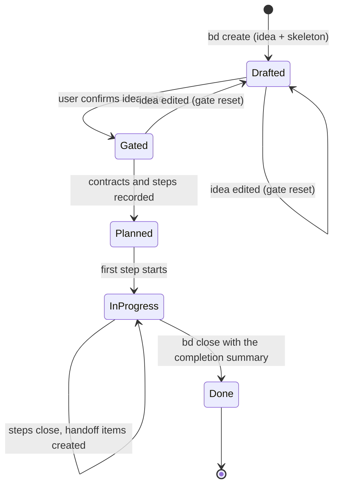

# Plans in beads — how it should be

Gate: confirmed by user, 2026-09-04

A plan is a durable, shared record of what a feature should be and how it
gets built. Today it is a directory of markdown files inside one git
worktree. It should instead live in the repository's beads database — the
same store that already holds the issue backlog — so that every worktree,
every agent, and the user see one plan, in one place, for as long as the
repository exists.

This file is deliberately blind to implementation cost.

## Why files in a worktree were not ideal

- A plan pinned to one branch is invisible from a sibling worktree until
  it is merged, so parallel agents cannot read each other's plans.
- The directory is disposable: once the work merges, the plan is a pile of
  history that nobody reopens, and HANDOFF.md had to be folded by hand.
- The file layout (`<date>-<NN>-<slug>/`) needed a serial counter that
  parallel worktrees could collide on.
- Decisions, status and handoff were four files that drifted from each
  other; the backlog was a fifth place.

## Use cases

### UC1 — draft a plan from any worktree, read it from any other

Actor: a coding agent (or the user) in worktree `web/`.
Situation: starting a feature; a sibling agent in `main/` is mid-way through
a related plan.
Intent: draft a plan and see the sibling's plan without switching branches.

Walkthrough:

1. The agent invokes ngplan. The skill creates one plan bead (title, labels,
   the plan's idea statement) with a single `bd create`.
2. The bead ID is the plan's address. Anything that refers to the plan —
   a handoff item, a sub-plan, a commit message — names that ID.
3. In `main/`, `bd list -t epic` (or the plan label) shows the new plan the
   same minute, with the same content, no fetch or merge needed.
4. Both agents append comments to their own plans; nothing conflicts
   because the store is one database, not two branches.

### UC2 — review a plan in a browser, diagrams rendered

Actor: the user.
Situation: an agent reports a plan is ready for the idea gate.
Intent: read the idea statement and its mermaid diagrams as rendered
documents, and read the decision thread in order.

Walkthrough:

1. The user opens `crabswarm preview` in the browser. Beside the registered
   directory roots there is a "plans & issues" root backed by the beads
   database.
2. Selecting the plan shows the idea statement, the plan body, status and
   acceptance criteria as rendered markdown with mermaid diagrams drawn
   inline, using the renderer the previewer already has for files.
3. The comment thread renders below as the decision log: each
   `Decision:` and `Discussion:` comment in order, with its author and time.
4. Children (steps, handoff items, sub-plans) are listed with their status.
5. Fallback without the browser: `bd show <id>` prints the same fields as
   text, which is enough for an agent that never opens a GUI.

### UC3 — the plan outlives its worktree

Actor: the user, months later.
Situation: a defect surfaces in code that came from a plan whose worktree
is long deleted.
Intent: find the plan and its decisions.

Walkthrough:

1. `bd search "<feature words>" --status all` finds the closed plan bead.
2. `bd show <id>` prints the idea, the plan and the decision comments;
   the close reason says what shipped.
3. Handoff items born from that plan are linked to it and still open or
   closed on their own merits.

### UC4 — handoff items are born in the backlog

Actor: an implementing agent.
Situation: while executing a plan step, an out-of-scope defect is found.
Intent: record it so it survives, without a fold step later.

Walkthrough:

1. The agent creates a backlog task bead with a `discovered-from`
   dependency on the plan bead, in one command.
2. The step bead it was found under gets a `Discussion:` comment naming
   the new item by ID.
3. There is no HANDOFF.md and no fold moment: the item is already in the
   durable backlog, linked to its origin.

### UC5 — the idea gate lives on the bead

Actor: the user and the planning agent.
Situation: the idea round is done.
Intent: confirm the gate once, and have every later session trust that
record rather than chat memory.

Walkthrough:

1. The agent asks the fixed gate question.
2. On "Yes", the agent records the confirmation on the plan bead itself,
   with the date, and a `Decision:` comment saying the gate passed.
3. Any later session reads the gate state from the bead. A substantive
   edit to the idea statement resets it.

### UC7 — steps are children, status is what the children say

Actor: an implementing agent, and the user checking progress.
Situation: the plan is gated and its steps are recorded.
Intent: work one step at a time and see progress without reading prose.

Walkthrough:

1. Each implementation step is a child task bead of the plan, ordered by
   `blocks` dependencies where one step needs another.
2. `bd ready` shows the steps whose blockers are closed; the agent claims
   the first, does it, and closes it with the verification as the reason.
3. `bd show <plan> --children` and the GUI's children list show what is
   done, in progress and blocked. The plan's own status notes stay a short
   narrative on top of that, never a duplicate checklist.

### UC6 — a sub-plan hangs under its master

Actor: a planning agent.
Situation: a plan outgrows one bead.
Intent: split it without losing the whole-scope owner.

Walkthrough:

1. The agent creates a child plan bead under the master.
2. `bd show <master> --children` lists the sub-plans; the GUI shows them
   as a tree.
3. Each sub-plan has its own gate, decisions and steps; the master's
   acceptance criteria still cover the whole scope.

## Lifecycle

## Usability requirements

- **One command to create, one ID to name.** A plan is created with one
  `bd create`; everything else is `bd update`, `bd comment`, or a child
  `bd create`. The ID is the only handle anyone needs.
- **Findable by type and label.** Plans carry a dedicated type or label so
  `bd list` can show only plans, only open plans, or the plans a backlog
  item came from.
- **Rendered in the GUI, on beads' own terms.** The previewer shows a
  bead the way `bd` models it — title, type, status, labels, description,
  design, acceptance, notes, comments, children and dependencies — as
  rendered markdown with mermaid. Plans are ordinary beads to it; the
  plan convention is only a way of using those fields, so the GUI stays
  useful for the backlog too.
- **Readable without the GUI.** `bd show <id>` must present the idea, the
  plan, status, acceptance and the decision thread in a sensible order.
- **Steps are children.** Progress is read from child status, not from a
  hand-maintained checklist.
- **Diagrams are always valid by the end of a turn.** Whatever path a
  write took — `bd create`, `bd update`, `bd comment`, inline text, a
  file, an editor — a broken mermaid fence is caught before the agent's
  turn ends: the agent is told which bead, which field and what the
  parser said, and cannot finish until it is fixed. The check does not
  try to know what this turn touched; it simply looks at the open beads
  (or the most recently modified ones) every time, so nothing slips
  through because tracking missed it. The user never opens a plan with a
  diagram that does not draw.
- **Nothing is folded later.** Handoff items are backlog beads from the
  moment they are found.
- **The gate is on the record.** Gate state is a field on the bead, never a
  chat memory.
- **No new sync burden.** Whatever syncs the backlog off the machine syncs
  the plans too; the user runs it, the agent never does.

## Settled in the idea round (2026-09-04)

- Steps are child beads (UC7); status is derived from them.
- Existing plan directories stay as history; the user will order their
  migration once plans in beads are stable.
- The GUI is first-class in this plan and generic over beads; the ngplan
  skill and convention feed back into `ngicks/agents-package` afterwards.
- The mermaid guard is an end-of-turn sweep over open (or most recently
  modified) beads, not an interception of individual `bd` commands and
  not per-turn change tracking, so every write path is covered by one
  mechanism that needs no state.
