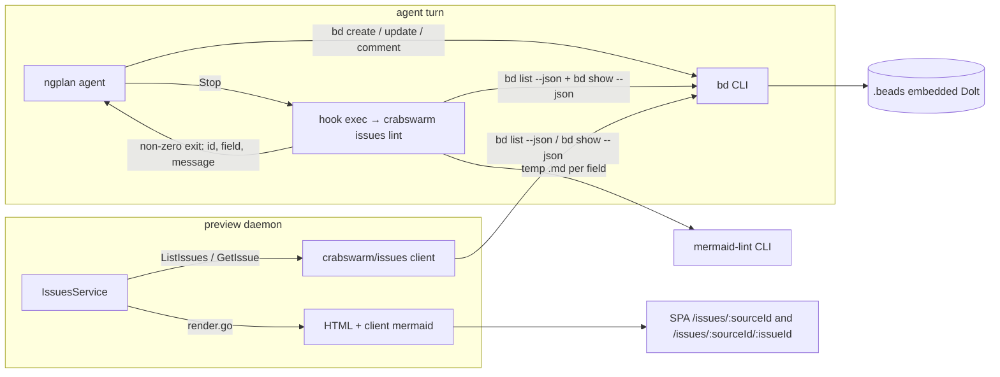
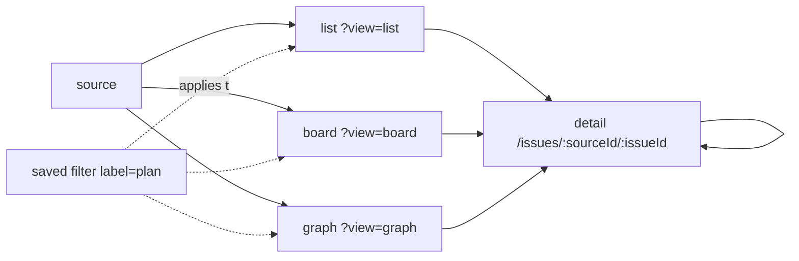

# Plans in beads

Move ngplan plans out of `doc/plan/<date>-<slug>/` and into the beads
database, one bead per plan with steps as child beads; guard mermaid in
bead text with an end-of-turn sweep; browse beads, rendered, in
`crabswarm preview` as a generic issue viewer with list, board, dependency
graph and detail views.

Status: idea gate confirmed 2026-09-04. Contracts and steps below are
drafted with tentative defaults; open questions 5–11 decide them.

## Goal / success criteria

Derived from IDEA.md.

- A plan created from one worktree is readable from every other worktree
  without a git operation (UC1).
- The user can read any bead — plans and backlog items alike — in the
  browser with description, design, acceptance, notes, comments, children
  and dependencies rendered as markdown with mermaid (UC2), and as text via
  `bd show` (UC3).
- The same viewer offers a list, a kanban board by status with epic
  swimlanes, and a dependency graph; plans are a saved filter plus
  affordances every issue gets, never a separate view (D14).
- A handoff item is a backlog bead linked to the step that found it from
  creation (UC4).
- The idea gate state is stored on the plan bead (UC5).
- Sub-plans are children of their master (UC6); steps are child tasks and
  progress is read from them (UC7).
- A mermaid fence that does not parse, in any text field or comment of an
  open bead, blocks the agent's turn with the bead ID, field and parser
  message.

## Scope

- The field convention (D1) and its identification rules: type, labels,
  metadata keys.
- `crabswarm issues lint`: sweep issues through the `bd` CLI and validate
  mermaid fences; a Stop hook that runs it (D3, D10).
- Issue sources in the preview daemon (`bd where` discovery, `--root` /
  `--issue` on `crabswarm preview`), `IssuesService`, and the SPA's tab
  header with list, board, graph and detail views (D4, D6, D13, D14, D15).
- Repository instructions (`.apm/instructions/base.instructions.md`)
  updated to the convention.
- A boundary bead for `ngicks/agents-package` (skill rewrite, hook
  packaging).
- Dogfood: re-author this plan as the first plan bead once steps 1–3 land.

## Non-goals

- Rewriting the ngplan skill itself (ships from `ngicks/agents-package`;
  feedback after the convention and GUI are tried here, D4).
- Migrating the 14 existing `doc/plan/` directories (D2; the user orders
  it later).
- Editing beads in the GUI; writes stay on `bd`.
- A plan-specific GUI. The previewer renders beads generically; plans are
  beads that follow a convention (D4, D14): a `plan` saved filter, and
  affordances — epic progress, comment-prefix badges, metadata chips —
  that light up for any issue that has the data.
- New dependency types. bd's `blocks`, `parent-child`, `discovered-from`
  and `related` are what the graph draws; a new kind is a request to
  beads, not a crabswarm change (D14).
- Drag-and-drop or any write from the board or graph (reading only).
- Replacing beads' sync; `bd dolt push` stays the user's job.
- Reading Dolt directly. All access goes through the `bd` CLI (D5).

## Context

- Backlog: 45 beads (42 open, 3 closed) migrated 2026-09-04 from the
  retired `doc/plan/issue/`. Database `.beads/embeddeddolt` at the
  repository root beside `.bare`, outside every worktree; `bd` resolves it
  from any worktree via the git common dir.
- Read paths verified 2026-09-04 with a throwaway ephemeral bead (deleted
  afterwards):
  - `bd show <id> --json --include-comments` returns `description`,
    `design`, `acceptance_criteria`, `notes`, `metadata`, `labels`,
    `comments[]` (`author`, `text`, `created_at`), status, type, counts.
    Empty fields are omitted from the JSON.
  - `bd list --json` returns the same text fields minus comments, labels
    and metadata; `--parent <id>` filters children.
  - `bd export --all` streams every bead as JSONL with comments; ~1.1 s.
  - `bd sql` is **not supported in embedded mode**.
  - One `bd` invocation costs ~1.5 s (embedded Dolt startup). Three
    concurrent invocations succeed.
  - Metadata: `bd create --metadata '<json>'`, `bd update --set-metadata
    k=v` / `--unset-metadata k`.
- Beads defines no semantics for `design`, `notes`, `context`; only
  `acceptance` has tooling (`--validate`, `validation.on-close`).
- Edges for a graph: `bd export` carries only `dependency_count` /
  `dependent_count`; `bd dep list <id...> --json` takes many IDs and
  returns a flat array of dependency records in one call, and
  `bd graph --all --json` returns open issues grouped by connected
  component (each with its issues; shape of edges to be confirmed against
  a database that has some — this one has none yet). One batched
  `bd dep list` per source is the planned edge source.
- Community beads GUIs (bd-board, Bead Me Up Scotty, beads-ui, BeadSpec,
  Lista Beads) converge on list, kanban by status with epic swimlanes and
  progress, a dependency graph, and a detail page, all reading through
  `bd --json` — the shape D14 adopts.
- Preview daemon (`crabswarm/preview/`): filesystem roots via
  `ListRoots` / `AddRoot` / `RemoveRoot` / `GetTree` / `GetDocument` /
  `WatchEvents` in
  `api/schema/proto/ngicks/crabswarm/preview/v1/preview_service.proto`;
  Connect handler in `crabswarm/preview/httpapi/handler.go`; markdown
  rendered by `crabswarm/preview/render/render.go` (goldmark, mermaid in
  client render mode, no CDN script). SPA under `web/src/`
  (Preact, `@tanstack/preact-query`, `preact-iso` router), documents at
  `/r/{rootId}/{path...}`, `mermaid` 11.16.0 already bundled.
- Hooks: `crabswarm hook exec` templates in `.claude/settings.json`,
  deployed by apm from `ngicks/agents-package`; the repo's own `apm.yml`
  lists only remote dependencies. `hook exec` supports Stop: non-zero exit
  blocks with the output as reason; `blockDecision`/`context` available.
  `hk` 1.57 is installed; no `hk.pkl` in the repo.
- Tooling: `node`, `npx`, `pnpm` on PATH; `mmdc` not installed;
  `web/package.json` has no `jsdom`, `happy-dom` or `mermaid-cli`.
- Command layout: `cmd/crabswarm/commands/<a>_<b>.go` per verb, RunE
  calling into `crabswarm/<a>/`; the go-edit-cobra skill governs edits
  there.

## Approach

### Convention (D1)

| Plan artifact | Bead | Notes |
|---|---|---|
| Plan | type `epic`, label `plan` | title = plan name |
| IDEA.md | `description` | idea statement, use cases, usability |
| `Gate:` line | metadata `idea_gate` = `YYYY-MM-DD`; absent = not confirmed | Q7 |
| PLAN.md | `design` | goal, scope, context, approach, surface delta, testing, risks |
| Success criteria | `acceptance_criteria` | |
| STATUS narrative | `notes`, via `--append-notes` | progress itself is child status |
| Implementation step | child `task`, label `step`, `blocks` deps for order | `bd ready` drives execution |
| Sub-plan | child `epic`, label `plan` | own gate, own steps |
| Handoff item | `task` with `discovered-from:<step or plan id>` | born in the backlog |
| Decision | comment `Decision: ...` | append-only |
| Open question / discussion | comment `Discussion: ...` | |
| Plan done | `bd close --reason` | completion summary |

### Components



### Data path: `bd` CLI only (D5)

A `crabswarm/issues` package shells out to `bd` with `--json`, with the
working directory set to the caller's root so `bd` discovers the right
database. Rejected in D5: a Dolt Go driver (huge dependency, duplicates
beads' storage layer, and embedded mode may not allow a second opener);
`bd export` per request (whole-database read for one bead).

### Preview integration: an "issues" surface beside "roots" (D6, D13)

The previewer grows a second top-level surface. The SPA gets a tab header
at the top of the page switching between **Roots** (today's file browser)
and **Issues** (beads). URLs move with it: the file browser's `/r/{rootId}/…`
becomes `/roots/{rootId}/…` — a breaking change to bookmarked URLs, accepted
by the user — and issues live under `/issues/…`.

Issues have their own registry, **issue sources**, beside the root
registry (D13). `crabswarm preview [DIR]` registers DIR as a file root
*and* resolves DIR's beads database by running
`BD_JSON_ENVELOPE=1 bd where --json` in DIR; the `.beads` directory it
reports (`data.path`) becomes the source's identity, so every worktree of
one repository maps to the same source. `--root` registers only the
directory; `--issue` registers only the issues source; neither flag means
both. A directory where `bd where` fails (`no_beads_directory`) simply
registers no source, and `--issue` there is an error. `preview list`
shows both registries; `preview remove` accepts a root or a source.

In the API the issues surface is its own Connect service, `IssuesService`,
in a new proto package `ngicks.crabswarm.issues.v1`, with source
management and the two read RPCs. Rejected in D6: RPCs bolted onto
`PreviewService`; a synthetic root over `GetTree` / `GetDocument`.
Rejected in D13: keying issues by preview root (several worktrees would
show one database several times; a root is a directory, a source is a
repository).

### Views: a generic issue viewer, plans as a filter (D14, D15)

Four views per source, switched by `?view=` on the list URL, plus the
detail page:

| View | Shows | Data |
|---|---|---|
| list (default) | table under the search bar: one GitHub-style query (`is:` `status:` `label:` `type:` `parent:` `priority:` and free text, negation, AND / OR, quotes) with suggestions for the token under the caret; the sidebar's status strip, **Plans** chip (`is:plan`) and label picker edit tokens of that query (D18) | `ListIssues` |
| board | kanban columns for the statuses the filter lists (bd's default has no closed, so no empty closed column); optional swimlanes by parent epic; cards show id, title, priority, label chips | `ListIssues` |
| graph | dependency graph of the filtered set, nodes colored by status, edges by type (`blocks`, `parent-child`, `discovered-from`, `related`), click → detail; issues no edge touches are hidden unless `isolated=show` | `ListIssues` + `ListDependencies` |
| detail | header, rendered fields, children with progress, dependencies, comments; a local graph of the issue's neighbourhood | `GetIssue` |

Convention-aware affordances, applied to every issue that has the data:
an epic progress bar from child status (any epic, not only plans); a
`Decision` / `Discussion` badge on comments by text prefix; metadata as
chips, so `idea_gate` shows without special code; `discovered-from`
edges labelled as such. Nothing checks for the `plan` label except the
saved filter. Rejected in D14: a separate plan view (it would only
re-derive these from generic data and drift from the generic page).

The graph is drawn with the `mermaid` already bundled in the SPA: the
client emits a `flowchart LR` from the edge list and renders it with the
same `mermaid.run` path `DocView` uses, so no layout library is added
(D15). Click-through uses the rendered SVG's node ids, not mermaid's
`click` directive, keeping `securityLevel: "strict"`. Limits accepted:
mermaid's layout is not interactive and degrades past a few hundred
nodes; the graph view therefore renders the *filtered* set and caps at a
warned-about size (default 150 nodes).



#### Presentation preview

A runnable mock of the Issues tab lives at `web/mock/plans_in_beads/`
(read its `MOCK_LIMITS.md` first). It is an isolated Preact entry served
by the app's own vite toolchain, fed by `doc/plan/2026-09-04-plans_in_beads/mock/gen.go`,
which renders a frozen `bd export` of the real backlog plus a synthesized
plan issue (this plan, stored per D1) through the previewer's real
markdown renderer. Run from `main/`:

```sh
go run doc/plan/2026-09-04-plans_in_beads/mock/gen.go
cd web && pnpm exec vite --config mock/plans_in_beads/vite.config.ts
```

It demonstrates D1 (a plan read as an ordinary issue: fields, `idea_gate`
chip, `Decision:` comments, step children with `blocks` order,
`discovered-from` items), D6 (tab header, `/issues/{sourceId}[/{issueId}]`),
D7, D12, D13 (source switcher), D14 (list, board and graph views behind
`?view=`, the **Plans** saved filter, epic progress bars, comment badges,
metadata chips, filters in the query string) and D15 (the graph and the
detail page's neighbourhood drawn by the bundled mermaid, click-through
via SVG node ids). The status strip, label picker and view strip are Ark
UI parts skinned with daisyUI, as step 6 plans them. It fakes the daemon,
`bd`, the stream, the edges (the real database has none yet) and the
Roots tab; the limits file lists what it therefore cannot validate
(latency, poll cost, discovery, the lint guard, the `/roots` move, the
`bd dep list` record shape, the graph's size cap). Disposable: nothing
in it graduates to `web/src`; steps 6–8 rewrite the views against the
real client. Findings from building it are folded in below:
`close_reason` is markdown and is rendered like the other fields; heading
anchors must be namespaced per field because description and design are
two documents on one page; `IssueDependency.outgoing` must be pinned to
the edge's `from` side so the table's wording and the graph's arrows
agree; the board's columns follow the status filter, since bd's default
listing has no closed issues and a permanent closed column would sit
empty; and the graph view hides issues no edge touches by default (a
backlog is mostly unconnected, and mermaid stacks them in one column), an
`isolated=show` query flag drawing them.

Freshness (D8): the daemon polls each registered source — one
`bd list --json --status all` every 10 s — diffs IDs and
`updated_at` against the previous poll, and pushes `IssuesChanged` on a
`WatchIssues` stream of `IssuesService`; the SPA invalidates the affected
queries exactly as it does for file changes. `bd` 1.2.2 has no change
feed; when a release ships `bd events --follow` (expected around 1.2.3),
the poller is replaced by a follower, tracked as a backlog issue (step 7).

### Mermaid validation: the `mermaid-lint` CLI already used for files (D9)

`ngicks/agents-package` ships `hooks/markdown-mermaid-lint`, a PostToolUse
hook running `mermaid-lint <files>` on edited markdown; the CLI is the npm
package `mermaid-lint-cli` (0.53.1 here, installed through mise). It
parses every ```` ```mermaid ```` fence in a markdown file without a
browser, reports `file:line:col: parse error: …`, has `--format json`
(per-diagram `line`, `type`, `ok`, `error`) and exits 1 on any failure.
`crabswarm issues lint` writes each text field and comment of a swept bead
to a temp file named `<id>.<field>.md` / `<id>.comment-<n>.md`, runs one
`mermaid-lint --format json --quiet` over them, and maps findings back to
bead, field and line. No new dependency: the dev environment already
provides `mermaid-lint`. Rejected in D9: a node script over the bundled
`mermaid` (a second engine to keep in step with the file hook);
`@mermaid-js/mermaid-cli` (Chromium per developer).

### Sweep selection: all open issues (D10)

`crabswarm issues lint` reads `bd list --json` (open, in-progress and
blocked — bd's default), then `bd show --json --include-comments` per
issue whose text contains ```` ```mermaid ````. At 42 open issues that is
one list call plus a show call per issue with a fence — typically a
handful — so a few seconds per turn. `--limit N` sorts by `updated_at`
and takes the newest N instead, any status; `--all` includes closed
issues. Modified `.md` files in the worktree are not swept here: they are
the file hook's job (`hooks/markdown-mermaid-lint`, D11).

### Hook placement: this repository's apm-managed hooks (D11)

The Stop hook entry is packaged the way agents-package packages hooks —
a `hooks/<name>/hooks/hook.json` with `version: 1` — inside this
repository's apm project (`hooks/issues-mermaid-lint`), so `apm install` deploys it beside the
golangci-lint and vet hooks; step 3 verifies apm accepts a local path
dependency, and if it does not, the fallback is a documented entry for
the user's `settings.local.json`. Feedback to `ngicks/agents-package`
follows D4. The existing `markdown-mermaid-lint` hook package should be
added to this repo's `apm.yml` at the same time so files get the guard
the beads get.

## Public surface delta

### Dependency delta

`go.mod` is unchanged: the beads client shells out to `bd`, mermaid
validation shells out to `mermaid-lint`. Both are dev-environment tools
(mise), and the dev-environment definition lives outside this repository.

`web/package.json` gains one runtime dependency for the search bar's
query language (D18); the mock uses it today, and step 6 carries it into
`web/src` unless Q14 moves evaluation to the daemon:

```json
"liqe": "3.8.7"
```

```yaml
# apm.yml — dependencies.apm (D11)
- git: github.com/ngicks/agents-package
  path: hooks/markdown-mermaid-lint        # files get the same guard
- path: hooks/issues-mermaid-lint         # local hook package: the Stop hook (form verified in step 3)
```

### CLI

```sh
# Sweep issues and validate every ```mermaid fence in description, design,
# acceptance, notes and comments. Exit 1 with one line per failure:
#   <issue-id> <field>[#<comment-n>]:<line>:<col>: <parser message>
crabswarm issues lint                # open issues (default)
crabswarm issues lint --all          # open and closed
crabswarm issues lint --limit 20     # newest 20 by updated_at, any status
crabswarm issues lint --json         # findings as a JSON array
crabswarm issues lint -C <dir>       # run bd from <dir> (default: cwd)

# Preview registration (changed): DIR becomes a file root and, when
# `bd where` succeeds in DIR, an issues source keyed by its .beads path.
crabswarm preview [DIR]              # both (default)
crabswarm preview --root [DIR]       # file root only
crabswarm preview --issue [DIR]      # issues source only; error when DIR has no beads database
crabswarm preview list               # roots and issue sources, each with ID, name, path
crabswarm preview remove <id|name>   # either kind
```

Stop hook entry (`hooks/issues-mermaid-lint/hooks/hook.json` in this repo,
deployed by apm into `.claude/settings.json` and `.codex/hooks.json`, D11):

```json
{
  "version": 1,
  "hooks": {
    "Stop": [
      {
        "hooks": [
          {
            "type": "command",
            "command": "crabswarm hook exec 'crabswarm issues lint'",
            "timeout": 120
          }
        ]
      }
    ]
  }
}
```

### Proto (new: `api/schema/proto/ngicks/crabswarm/issues/v1/issues_service.proto`)

`PreviewService` is unchanged. Names say "issue" on the wire and in the
GUI; "bead" stays the name of the store and of the `bd` client (Q12).

```proto
syntax = "proto3";
package ngicks.crabswarm.issues.v1;
import "google/protobuf/timestamp.proto";
import "ngicks/crabswarm/preview/v1/preview_service.proto"; // Heading

// IssuesService exposes registered beads databases ("issue sources").
service IssuesService {
  // ListSources returns the registered issue sources.
  rpc ListSources(ListSourcesRequest) returns (ListSourcesResponse);
  // AddSource resolves DIR's beads database with `bd where` and registers it.
  // Re-adding a directory of the same repository is idempotent. Fails with
  // NotFound when DIR has no beads database.
  rpc AddSource(AddSourceRequest) returns (AddSourceResponse);
  // RemoveSource drops a registered source.
  rpc RemoveSource(RemoveSourceRequest) returns (RemoveSourceResponse);
  // ListIssues lists a source's issues newest-updated first.
  rpc ListIssues(ListIssuesRequest) returns (ListIssuesResponse);
  // GetIssue returns one issue with every text field rendered to HTML, its
  // comments, children and dependencies.
  rpc GetIssue(GetIssueRequest) returns (GetIssueResponse);
  // ListDependencies returns every dependency edge among the given issues
  // (all issues of the source when issue_ids is empty), in one bd call.
  rpc ListDependencies(ListDependenciesRequest) returns (ListDependenciesResponse);
  // WatchIssues streams change notifications produced by the daemon's
  // per-source poll (D8).
  rpc WatchIssues(WatchIssuesRequest) returns (stream WatchIssuesResponse);
}

// Source is a registered beads database.
message Source {
  // ID is a stable identifier derived from the absolute .beads path.
  string id = 1;
  // BeadsPath is the absolute .beads directory (bd where: data.path).
  string beads_path = 2;
  // Prefix is the issue-ID prefix (bd where: data.prefix), used as the name.
  string prefix = 3;
  // Dir is the directory the source was registered from; bd runs there.
  string dir = 4;
}

message ListSourcesRequest {}
message ListSourcesResponse {
  repeated Source sources = 1;
}
message AddSourceRequest {
  // Dir is a directory inside the repository; may be relative.
  string dir = 1;
}
message AddSourceResponse {
  Source source = 1;
}
message RemoveSourceRequest {
  string source_id = 1;
}
message RemoveSourceResponse {}

enum IssueStatus {
  ISSUE_STATUS_UNSPECIFIED = 0;
  ISSUE_STATUS_OPEN = 1;
  ISSUE_STATUS_IN_PROGRESS = 2;
  ISSUE_STATUS_BLOCKED = 3;
  ISSUE_STATUS_CLOSED = 4;
}

message IssueSummary {
  string id = 1;
  string title = 2;
  string issue_type = 3;          // bd's type string: task, epic, bug, ...
  IssueStatus status = 4;
  int32 priority = 5;
  repeated string labels = 6;
  string parent_id = 7;           // "" for top-level
  int32 comment_count = 8;
  int32 child_count = 9;
  google.protobuf.Timestamp created_at = 10;
  google.protobuf.Timestamp updated_at = 11;
  int32 child_closed_count = 12;  // for the epic progress affordance (D14)
  string metadata_json = 13;      // verbatim JSON object; "{}" when unset — chips in list and board
}

message RenderedField {
  string html = 1;                // rendered markdown fragment; "" when the field is empty
  repeated ngicks.crabswarm.preview.v1.Heading toc = 2;
}

message IssueComment {
  string id = 1;
  string author = 2;
  RenderedField text = 3;
  google.protobuf.Timestamp created_at = 4;
}

message IssueDependency {
  string id = 1;                  // the other issue
  string title = 2;
  string type = 3;                // blocks, parent-child, discovered-from, related
  // outgoing is true when this issue is the edge's from side (IssueEdge.from_id):
  // it depends on, is a child of, or was discovered from the other issue.
  // parent-child rows are omitted here; children and parent_id carry them.
  bool outgoing = 4;
}

message Issue {
  IssueSummary summary = 1;
  RenderedField description = 2;
  RenderedField design = 3;
  RenderedField acceptance_criteria = 4;
  RenderedField notes = 5;
  string metadata_json = 6;       // bd metadata, verbatim JSON object; "{}" when unset
  RenderedField close_reason = 7; // close reasons are markdown too (mock finding)
  repeated IssueComment comments = 8;
  repeated IssueSummary children = 9;
  repeated IssueDependency dependencies = 10;
}

message ListIssuesRequest {
  string source_id = 1;
  // Status filter; empty means open, in-progress and blocked (bd's default).
  repeated IssueStatus statuses = 2;
  // Label filter (all must match).
  repeated string labels = 3;
  // Only children of this issue.
  string parent_id = 4;
}

message ListIssuesResponse {
  repeated IssueSummary issues = 1;
}

message GetIssueRequest {
  string source_id = 1;
  string issue_id = 2;
}

message GetIssueResponse {
  Issue issue = 1;
}

message IssueEdge {
  string from_id = 1;             // the dependent / child / discoverer
  string to_id = 2;               // what it depends on / parent / origin
  string type = 3;                // blocks, parent-child, discovered-from, related
}

message ListDependenciesRequest {
  string source_id = 1;
  repeated string issue_ids = 2;  // empty: every issue of the source
}

message ListDependenciesResponse {
  repeated IssueEdge edges = 1;
}

message WatchIssuesRequest {}

// IssuesChanged signals that issues of a source were created, updated or
// closed since the previous poll; an empty issue_ids means "refetch all".
message IssuesChanged {
  string source_id = 1;
  repeated string issue_ids = 2;
}

// SourcesChanged signals that the source registry changed.
message SourcesChanged {}

message WatchIssuesResponse {
  oneof event {
    IssuesChanged issues_changed = 1;
    SourcesChanged sources_changed = 2;
  }
}
```

### SPA routes (`web/src/routes.tsx`) — breaking change

```text
/                              tab header: Roots | Issues; root picker or source picker for the active tab
/roots/{rootId}/{path...}      file browser (was /r/{rootId}/{path...}; old URLs 404)
/issues/{sourceId}             list (default); ?view=board | graph switch the view; the search
                               bar's query in q (GitHub style: q=is:open label:chat -label:tui
                               type:epic priority:<2 free text; absent = is:open; the Plans saved
                               filter is q=is:plan), view options beside it (lanes=none for the
                               board, isolated=show for the graph); the query string is carried
                               onto the detail URL and back
/issues/{sourceId}/{issueId}   issue detail: fields, comments, children, dependencies, local graph
```

The raw endpoint `GET /raw/{rootId}/{path...}` is unchanged.

### Go packages

```go
// crabswarm/issues — bd CLI client, source registry and the IssuesService.
package issues

// Where runs `BD_JSON_ENVELOPE=1 bd where --json` in dir.
// ErrNoBeads wraps bd's no_beads_directory.
func Where(ctx context.Context, dir string) (Location, error)
type Location struct{ BeadsPath, DatabasePath, Prefix string }

type Client struct{ /* bd binary, dir, logger */ }
func NewClient(dir string, opts ...Option) *Client
func (c *Client) List(ctx context.Context, f ListFilter) ([]Summary, error)        // bd list --json
func (c *Client) Children(ctx context.Context, id string) ([]Summary, error)      // bd list --json --parent <id>
func (c *Client) Get(ctx context.Context, id string) (*Issue, error)              // bd show --json --include-comments
func (c *Client) Dependencies(ctx context.Context, ids []string) ([]Edge, error)  // bd dep list <ids...> --json, one call

type ListFilter struct {
    Statuses      []Status
    Labels        []string
    ParentID      string
    Limit         int
    SortByUpdated bool
}

// Issue mirrors bd's JSON: Summary plus Description, Design,
// AcceptanceCriteria, Notes, Metadata (json.RawMessage), CloseReason,
// Comments []Comment, Dependencies []Dependency. Omitted JSON fields
// decode as empty.

// SourceStore mirrors preview.RootStore: in-memory, keyed by the ID
// derived from Location.BeadsPath, deduplicated by name (Prefix).
type SourceStore struct{ /* ... */ }

// Service implements issuesv1connect.IssuesServiceHandler over a
// SourceStore, one Client per source, and render.Render for every text
// field. It runs one Poller per source for WatchIssues.
type Service struct{ /* ... */ }
func NewService(logger *slog.Logger, renderer Renderer, opts ...ServiceOption) *Service
func WithPollInterval(d time.Duration) ServiceOption // default 10s

// Poller lists a source on an interval and emits IssuesChanged diffs.
type Poller struct{ /* ... */ }

// crabswarm/issues/mermaidlint — runs mermaid-lint over issue text.
package mermaidlint

type Finding struct {
    IssueID string
    Field   string // description, design, acceptance_criteria, notes, comment
    Comment int    // 1-based comment index when Field == "comment"
    Line    int    // line inside the field
    Col     int
    Type    string // diagram type as mermaid-lint reports it
    Message string // parser message
}
// Lint writes each non-empty text field and comment of every issue to a
// temp file, runs `mermaid-lint --format json --quiet` once over them and
// maps the JSON back to findings. Issues with no ```mermaid fence are
// skipped before any file is written.
func Lint(ctx context.Context, issues []issues.Issue) ([]Finding, error)
```

### Repository layout

```text
crabswarm/issues/                   bd client, Where, SourceStore, IssuesService (new)
crabswarm/issues/mermaidlint/       mermaid-lint runner over issue text (new)
cmd/crabswarm/commands/issues.go    `crabswarm issues` group (new)
cmd/crabswarm/commands/issues_lint.go
cmd/crabswarm/commands/preview.go   --root / --issue flags; registers both by default (changed)
cmd/crabswarm/commands/preview_list.go, preview_remove.go   cover sources (changed)
api/schema/proto/ngicks/crabswarm/issues/v1/issues_service.proto (new)
crabswarm/preview/httpapi/handler.go   mounts IssuesService beside PreviewService (changed)
hooks/issues-mermaid-lint/hooks/hook.json   Stop hook package (new, D11)
```

`web/src` is reorganised in step 6 into the page-based layout the user
fixed (the mock under `web/mock/plans_in_beads/` already follows it):

```text
web/src/
├── main.tsx                  mount the app, install providers
├── app.tsx                   app shell and routing (was routes.tsx)
├── index.css                 global styles, tailwind/daisyUI
├── pages/                    route-level screens
│   ├── preview/              /roots/…: index.tsx, FileTree.tsx, DocumentView.tsx (was DocView), Toc.tsx, ImageView.tsx, usePreview.ts
│   ├── issues/               /issues/…: index.tsx, IssueFilters.tsx, IssueList.tsx, IssueBoard.tsx (D14), IssueGraph.tsx (D14, D15), IssueView.tsx, MarkdownField.tsx, SourceSwitcher.tsx, useIssues.ts
│   └── not-found.tsx
├── components/               UI shared across pages
│   ├── Layout.tsx            drawer shell
│   ├── Header.tsx            Roots | Issues tabs (Ark Tabs, daisyUI lifted skin), theme toggle
│   └── ui/                   reusable primitives (Dialog wraps Ark; OpenRawDialog moves here)
├── api/
│   ├── gen/                  generated protobuf code (was src/gen)
│   ├── client.ts             Connect transport, PreviewService + IssuesService clients
│   ├── preview.ts            query options for roots / tree / document (was queries.ts)
│   ├── issues.ts             query options for sources / issues / dependencies
│   └── events.ts             WatchEvents + WatchIssues subscriptions
├── signals/                  shared client-side state (ui.ts → preferences.ts + drawer/toc signals)
├── hooks/                    cross-page hooks, only if any appear
├── lib/                      focused non-UI helpers: paths.ts (+ paths.test.ts), format.ts, mermaid.ts (the shared run/enrich pass)
└── assets/                   imported images, icons, fonts
```

The move of existing files (`DocView` → `pages/preview/DocumentView.tsx`,
`src/gen` → `src/api/gen`, `routes.tsx` → `app.tsx`) is part of step 6
and changes `api/buf.gen.yaml`'s output path for `protoc-gen-es`. Imports
use the aliases the web preference rule fixes: `@/…` → `src/` (tsconfig
`paths` plus vite `resolve.alias`, kept in sync) and `#…` → `web/` via
`package.json` `imports` (`"#*": "./*"`, already added for the mock);
sibling files import with `./`.

### Persistent data format

No new store. One durable convention on bead metadata, a JSON object bd
already persists per bead:

```json
{ "idea_gate": "2026-09-04" }
```

`idea_gate` present = confirmed on that date; absent = not confirmed.
Set with `bd update <id> --set-metadata idea_gate=<date>`, reset with
`--unset-metadata idea_gate` (D7).

RPC schema: see Proto above. Config keys, environment variables: no change.

## Implementation steps

1. **`crabswarm/issues` client.** `Where` over
   `BD_JSON_ENVELOPE=1 bd where --json` (envelope errors → `ErrNoBeads`),
   `bd list --json` (with `--parent`), `bd show --json --include-comments`,
   all with a working directory and a context; decode into `Summary` /
   `Issue`, omitted fields as empty. Test against a fake `bd` script on
   PATH replaying recorded JSON (fixtures from the probes above). Verify:
   `go test ./crabswarm/issues/...`.
2. **`mermaidlint` over `mermaid-lint`.** Temp-file layout, one
   `mermaid-lint --format json --quiet` run, JSON decode, mapping back to
   issue/field/comment/line; skip issues with no fence. Test with the
   real `mermaid-lint` when on PATH (skip otherwise) plus a fake for the
   mapping. Verify: `go test ./crabswarm/issues/mermaidlint/...`.
3. **`crabswarm issues lint`, hook package, apm wiring.** Command per the
   CLI delta, exit 1 with one line per finding; `hooks/issues-mermaid-lint`
   package; `apm.yml` gains it and `hooks/markdown-mermaid-lint`. Verify:
   e2e in `e2e/crabswarm/` runs the built binary against a fake `bd`
   emitting one good and one broken fence and asserts exit code and line
   format; a Stop dry run through `crabswarm hook exec`; the user runs
   `apm install` outside the worktree and confirms the entry lands in
   `.claude/settings.json` (if apm rejects a local path, fall back per
   D11 and record it).
4. **Proto, source registry, daemon.** New `issues/v1` package,
   `go generate ./api/...` (needs `pnpm install` in `web/` first — see the
   open backlog item on fresh worktrees); `SourceStore` and `Service` in
   `crabswarm/issues`, mounted in `crabswarm/preview/httpapi/handler.go`
   beside `PreviewService`; `Poller` per source feeding `WatchIssues`
   (D8). Verify: service tests with the fake `bd`; `AddSource` on a
   directory without beads returns NotFound; two worktrees of one
   repository yield one source; a fake `bd` whose listing changes between
   polls produces one `IssuesChanged` with the changed IDs.
5. **`crabswarm preview` flags.** `--root` / `--issue`, default both;
   `preview list` and `preview remove` cover sources. Verify: command
   tests in `cmd/crabswarm/commands/preview_test.go`; e2e registering a
   directory with and without a beads database.
6. **SPA: layout, tabs, route move, list and detail.** Reorganise
   `web/src` into the page-based layout above (including the
   `src/gen` → `src/api/gen` move and its `buf.gen.yaml` output path);
   `Header`, routes moved to `/roots/…`, `SourceSwitcher`, `QueryBar`
   (the liqe query with suggestions, D18) and `IssueFilters` (status,
   labels and the **Plans** chip editing that query), `IssueList` and `IssueView` under
   `/issues/…`, queries in `web/src/api/queries.ts`, a `WatchIssues`
   subscription in `web/src/api/events.ts` invalidating issue queries
   (D8); mermaid renders through the same path `DocView` uses; heading
   anchors namespaced per field (`description--<id>`) as the mock does;
   affordances per D14 (epic progress from `child_closed_count`, comment
   prefix badges, metadata chips). Interactive widgets — the tab strip,
   the label multi-select and status toggle group in `IssueFilters` — are
   Ark UI components (`@ark-ui/react/tabs`, `/combobox`, `/toggle-group`)
   skinned with daisyUI, per the preact preference rule; static chrome
   stays plain daisyUI. Verify: `pnpm test`, Playwright e2e in
   `web/e2e/` updated for `/roots/…` and covering list and detail against
   a daemon backed by the fake `bd`.
7. **Board view.** `IssueBoard` at `?view=board`: status columns, optional
   swimlanes by parent epic with a progress bar per lane, same filter bar,
   cards link to detail; read-only. Verify: Playwright e2e — a fixture
   with two epics shows two lanes with the right counts; the Plans filter
   leaves only plan epics.
8. **Graph view and local graph.** `ListDependencies` in proto and
   service (`bd dep list` batched per source), `IssueGraph` at
   `?view=graph` and as the detail page's neighbourhood section: emit a
   mermaid flowchart from the edges (D15), colour by status, edge label
   by type, node click → detail via the rendered SVG ids, size cap with a
   warning. Verify: service test with a fake `bd dep list`; Playwright
   e2e — a `blocks` chain renders as connected nodes and a click
   navigates; a 200-node fixture shows the cap warning.
9. **Instructions and boundary.** Update `.apm/instructions/base.instructions.md`
   (plan location, convention summary, `crabswarm issues lint`, preview
   flags); create the agents-package boundary issue (skill rewrite, hook
   packaging) and the "replace the poller with `bd events --follow` once
   bd ships it" issue, both with `discovered-from` this plan. Verify:
   text review.
10. **Dogfood.** Re-author this plan as the first plan issue per D1: epic +
    `plan` label, description = IDEA.md, design = this file, acceptance =
    success criteria, `idea_gate` metadata (D7), steps 1–9 as child tasks
    in their finished state, decisions as comments. Verify: it renders in
    list, board (as an epic lane with progress), graph and detail, and
    `crabswarm issues lint` passes on it.

## Testing and verification

- Unit: `crabswarm/issues` decode and error paths, `Where` envelope errors; `mermaidlint.Fences`
  edge cases (nested fences, tildes, indented fences, unclosed fence).
- Node: the parse script over the visuals reference's diagram catalogue.
- e2e (`e2e/crabswarm/`): `issues lint` exit codes and output; preview
  daemon `AddSource` / `ListIssues` / `GetIssue` over Connect with the
  fake `bd`; `crabswarm preview` with and without `--root` / `--issue`.
- Web e2e: issue list and detail render, mermaid drawn, a change pushed
  through `WatchIssues` refreshes the open view; board lanes and counts;
  graph connectivity, click-through and the size cap.
- Manual: the Stop hook blocks a turn after a deliberately broken fence.

## Risks

- `mermaid-lint` is a third-party parser, not mermaid itself; a fence it
  rejects but the browser draws (or the reverse) is possible. Same
  exposure as the existing file hook; keep the version pinned in mise.
- Moving `/r/…` to `/roots/…` breaks bookmarks and the `web/e2e` specs;
  accepted (D6), no redirect planned.
- `bd` latency (~1.5 s per call) makes the sweep and the GUI feel slow if
  called per issue; mitigated by listing once and showing only issues
  whose text contains a fence, and by the 10 s poll interval.
- The daemon-side poll costs one `bd` call per source every 10 s even
  with no viewer; acceptable for a dev machine, and it goes away with
  `bd events --follow`.
- A mermaid-drawn graph is static and slow past a few hundred nodes; the
  filtered-set rule and the cap keep it usable, and D15 names the
  fallback (a layout library) if the cap bites in practice.
- The `bd dep list --json` record shape is unverified on a database with
  edges; step 8 pins it with a fixture from a real dependency.
- The Stop hook runs on every turn, including turns that never touched
  beads; acceptable at seconds, revisit with `--limit` if it grows.
- Empty fields are omitted from `bd`'s JSON; decoding must treat absence
  as empty, not as error.
- `bd` output formats are not a stable API; pin the `bd` version in the
  dev environment and keep the fake `bd` fixtures in step with it.

## Boundary — work handed to other repositories

- `ngicks/agents-package`: rewrite the ngplan skill to author beads per D1
  (create, gate metadata, steps as children, handoff via
  `discovered-from`); package the Stop hook if D11 keeps it local for now.
  Tracked as a bead in step 6.

## Open questions

Resolved 2026-09-04: Q1 → D1, Q2 → D2, Q3 → D3, Q4 → D4, Q5 → D5,
Q6 → D6, Q7 → D7, Q8 → D8, Q9 → D9, Q10 → D10, Q11 → D11, Q12 → D12,
Q13 → D13. 2026-09-05: D14 and D15 added from the user's generic-viewer
direction. 2026-09-06: D16–D18 from the mock.

14. **Where is the search query evaluated?** The mock parses the bar's
    query with liqe in the browser and evaluates it over the source's
    full `ListIssues` listing (D18). Options for step 4: (a) keep that —
    `ListIssuesRequest` drops `statuses` / `labels` / `parent_id`, the
    SPA fetches one listing per source and filters; cheap at this size,
    one `bd list` per poll already brings everything; (b) the daemon
    takes `query` text and evaluates a Go port of the grammar, so the
    same query works for `crabswarm issues lint --query` and for the
    CLI; (c) both, the daemon accepting `query` and the SPA keeping liqe
    for suggestions and instant feedback. Tentative default: (a) now, (b)
    when a CLI consumer appears.

## Traceability

Every operative decision clause and every IDEA.md use case, mapped to the
step that delivers it. "Boundary" is the agents-package issue created in
step 7 (the ngplan skill rewrite); "bd" means beads delivers it natively.

| Clause | Owner |
|---|---|
| D1 plan bead field convention | step 10 (first plan authored to it), step 9 (instructions), boundary (skill) |
| D1 steps are child tasks with `blocks` order | step 10, boundary; `bd ready` is bd |
| D1 handoff items via `discovered-from` | step 9 (two such issues created), boundary |
| D2 directories stay, no migration | non-goal; no step |
| D3 sweep + validate + Stop hook blocks the turn | steps 2, 3 |
| D4 GUI first-class, generic over beads | steps 4, 6 |
| D4 feedback to agents-package afterwards | step 9 (boundary issue) |
| D5 `bd` CLI is the only data path | step 1 |
| D6 tab header, `/roots` move, `/issues`, `IssuesService` | steps 4, 6 |
| D7 `idea_gate` metadata set/unset | step 10 (set on the dogfood plan), step 9 (instructions), boundary; shown by step 6 (`metadata_json`) |
| D8 daemon poll → `WatchIssues`; memo for `bd events --follow` | step 4 (poller), step 6 (subscription), step 9 (follow-up issue) |
| D9 reuse `mermaid-lint` | step 2 |
| D10 open issues by default, `--limit`, `--all` | step 3 |
| D11 local hook package, `apm.yml`, `markdown-mermaid-lint` dep, fallback | step 3 |
| D12 "issues" naming everywhere | steps 1–8 (names), step 9 (docs) |
| D13 sources via `bd where`, keyed by `.beads`, `--root` / `--issue`, list/remove | steps 1, 4, 5, 6 |
| D14 generic viewer: list, board, graph, detail; plans = saved filter + affordances; no plan view | steps 6, 7, 8 |
| D14 no new dependency types | non-goal; no step |
| D15 graph drawn with bundled mermaid, filtered set, size cap | step 8 |
| D16 board columns from the result, unconnected hidden, query string travels, `outgoing` = from side | steps 6, 7, 8 |
| D18 search bar with a GitHub-style query, liqe, widgets edit the query | step 6; evaluation site is Q14 (step 4) |
| UC1 draft from any worktree, read from any other | bd (shared database), D13 for the GUI (steps 4, 6), step 10 |
| UC2 review in the browser with mermaid | steps 4, 6, 7, 8 |
| UC3 plan outlives the worktree | bd (`bd search`, `bd show`); step 9 documents |
| UC4 handoff born in the backlog | step 9 (practised), boundary (skill); `discovered-from` edges drawn by step 8 |
| UC5 gate on the bead | D7 → steps 9, 10, boundary |
| UC6 sub-plans as children | bd (`--parent`); children list in steps 4, 6, lanes in 7; boundary |
| UC7 steps as children, status from children | children list and progress in steps 4, 6, 7; `bd ready` is bd; boundary |
| Diagrams valid by end of turn | steps 2, 3 |

Contract areas: public API (CLI, Go packages) — fenced above; dependencies
— no manifest change, `apm.yml` delta fenced; RPC schema — fenced proto;
project layout — fenced; persistent data — no new store, metadata key
fenced. Config keys and environment variables: no change.
