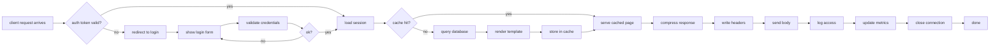

# Mermaid zoom test

A deliberately wide diagram:

```mermaid
flowchart LR
  A[client request arrives] --> B{auth token valid?}
  B -- yes --> C[load session]
  B -- no --> D[redirect to login]
  C --> E{cache hit?}
  E -- yes --> F[serve cached page]
  E -- no --> G[query database]
  G --> H[render template]
  H --> I[store in cache]
  I --> F
  F --> J[compress response]
  J --> K[write headers]
  K --> L[send body]
  L --> M[log access]
  M --> N[update metrics]
  N --> O[close connection]
  O --> P[done]
  D --> Q[show login form]
  Q --> R[validate credentials]
  R --> S{ok?}
  S -- yes --> C
  S -- no --> Q
```

An inline image:

Some text after.
